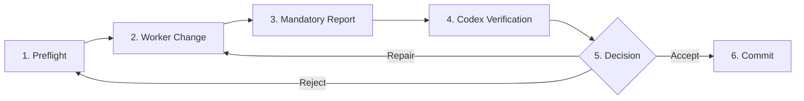

# AI Execution and Safety Protocol

## 1. Scope & Canonical Status

This document defines the single canonical execution, governance, and safety protocol for all artificial intelligence agents and human collaborators working in this repository. All subsequent instructions, scripts, and workflows are subordinate to this protocol.

---

## 2. Order of Authority

All decisions and actions within this project follow a strict hierarchy of authority:
1. **User Scope and Data Agreements**: Explicit boundaries defined by the project owner and compliance agreements (e.g., AHRQ MEPS Data Use Agreement).
2. **Codex Supervisor**: Supervises project architecture, issues gate specifications, performs independent code and test audits, and controls commit authorization.
3. **Current Gate Specification**: The exact, active task instructions defining scope, boundaries, and acceptance criteria for the current milestone.
4. **Gemini Implementation Worker**: Subordinate implementation agent responsible for strictly scoped execution, test verification, and structured reporting.

---

## 3. Gated Lifecycle & Review Workflow

Project progress is organized into discrete, sequential gates. Each gate follows a mandatory six-stage lifecycle:



1. **Preflight**: Verify working tree state, branch correctness, prerequisites, and baseline file integrity.
2. **Worker Change**: Gemini executes only the additive changes authorized in the active gate specification.
3. **Mandatory Report**: Gemini submits a complete, evidence-bounded audit report adhering to the exact template in Section 9.
4. **Independent Codex Verification**: Codex reviews file diffs, executes independent test suites, checks hash integrity, and validates claim boundaries.
5. **Decision**: Codex issues one of three verdicts:
   - **Accept**: Gate criteria fully satisfied.
   - **Repair**: Minor non-conformances identified; worker must remediate without expanding scope.
   - **Reject**: Serious protocol or integrity violation; rollback required.
6. **Commit**: Commits are made only upon supervisor approval. Gemini must never self-approve and must not stage or commit code unless explicitly commanded in the gate specification.

---

## 4. Baseline Immutability & Branch Architecture

- **Protected Baseline Tag**: `inherited-code-v0.3-baseline-20260828` (commit `038897e9f751edac6e36445b7706eec5fdb15988`, tree `9e43047f69326a844cec1e7acdb6726af555dff3`).
- **Active Research Branch**: `research/nhis-fairbias`.
- **Immutability Mandate**: The 14 inherited root files (`app.py`, `classifiers.py`, `config.py`, `data_COMPAS.csv`, `data_Credit_Card.csv`, `eval.py`, `main.py`, `module_AE.py`, `module_BM.py`, `module_load.py`, `module_transform.py`, `requirements.txt`, `results/all_results.json`, `start.sh`) and `.gitignore` are permanent historical baseline artifacts. They must never be altered, moved, renamed, reformatted, or deleted.
- **Additive Development**: All new implementation code, data, configurations, scripts, and tests must reside strictly within additive subdirectories (`src/`, `configs/`, `docs/`, `scripts/`, `tests/`). Root-level governance or build metadata (such as `pyproject.toml`) is permitted only when explicitly authorized by a gate specification.

---

## 5. Safety, Privacy & Repository Guardrails

- **Git Guardrails**:
  - Prohibited: destructive Git commands (`git reset --hard`, `git clean -fd`, `git push --force`, rebase, branch deletion).
  - Prohibited: modifying global Git configuration (`git config --global`).
- **Secrets & Credentials**:
  - No API keys, tokens, or private credentials may be embedded in source code, configuration files, or logs.
- **Data Privacy & Microdata Protections**:
  - Strict adherence to the AHRQ MEPS Data Use Agreement: no re-identification attempts, no external identifiable data linkage.
  - Prohibited: printing raw microdata rows, individual records, or identifiable data to stdout, logs, reports, or artifacts.
  - Prohibited: committing or uploading MEPS microdata to remote repositories or third-party services.

---

## 6. Network, Download & Artifact Management

- **Network Policy**: Default deny. Network access is disabled unless an explicit gate specification provides a domain-specific HTTPS allowlist.
- **Atomic Download Protocol**:
  - All downloads must use temporary files with a `.part` extension during transfer.
  - Checksum validation must occur before renaming `.part` to the final target path.
  - Downloads must be recorded in an execution provenance manifest containing target URL, timestamp, file size, and SHA-256 hash.
  - *Provenance Note*: A locally computed SHA-256 hash verifies local storage immutability and reproducibility; it does not constitute proof of publisher authenticity when no official upstream checksum exists.
- **Data & Run Directories**:
  - `data/raw/`, `data/interim/`, `data/processed/`, `runs/`, `outputs/`, and `artifacts/` are ignored by Git (except placeholder `.gitkeep` files).
  - Completed runs must never be overwritten. Every pipeline execution must generate a unique, timestamped run ID and immutable execution manifest.

---

## 7. Methodological, Survey & Fairness Standards

- **Leakage Prevention**:
  - Strict split before fitting: all data transformations, feature encoders, imputers, scalers, feature selectors, and fairness hyperparameter/threshold tuning must be fit strictly on the training partition.
  - Partitioning must respect longitudinal, person-level, and household-level boundaries (preventing cross-round or cross-panel leakage).
  - Test data is reserved strictly for final, unadjusted evaluation and must never inform model selection, hyperparameter tuning, or threshold setting.
- **Complex Survey Methodology**:
  - Survey design variables (sampling weights, strata, primary sampling units / PSUs) are design variables, never ordinary predictive features.
  - Survey-weighted estimation and design-adjusted standard errors / confidence intervals must be computed alongside unweighted sensitivity analyses.
- **Computational Scaling Guardrails**:
  - Prohibited: unchunked or unapproximated quadratic sample-pair matrices ($O(N^2)$ combinations across sample size $N$, such as legacy `eval.py` `num-c` cross-group difference matrix around lines 953–954 or `num-d` `pairwise_distances` around line 1026) on full MEPS cohorts. Note that the default `num-a` branch in `eval.py` is linear ($O(N)$) and not quadratic, but any future configuration enabling `num-c` or `num-d` must implement chunking or approximation guards.
  - Mandatory: chunked processing, sparse approximations, or explicit computational resource reviews prior to execution.

---

## 8. Claims Vocabulary & Evidence Tiers

To maintain strict scientific integrity, all discussions, reports, and documentation must differentiate between the following tiers of evidence:

1. **Inherited Run Record**: Evidence of a historical execution record preserved in legacy files (e.g., `results/all_results.json`), but not valid evidence of unbiased model performance, fairness improvement, reproduction of the paper, or MEPS validity.
2. **Software Reproduction**: Verification that a script executes without errors and reproduces identical numerical outputs from specified inputs under identical conditions.
3. **Validated Pipeline Findings**: Empirical results produced by the validated, leakage-free, survey-aware pipeline across gated milestones. No MEPS empirical claims are allowed until generated by this pipeline.
4. **Peer-Reviewed Paper Claims**: Methodologically sound findings that have undergone formal peer review, distinguished from internal pipeline-verified empirical claims.

---

## 9. Standard Worker Report Template

At the conclusion of each gate, the worker agent must output a report formatted with these exact headings:

```text
Gate:
Status:
Files changed:
Commands executed:
Permissions requested:
Tests executed:
Exact test results:
Input hashes:
Output hashes:
Row counts:
Assumptions:
Unresolved issues:
Git diff summary:
Proposed next step:
STOP — waiting for Codex review.
```

---

## 10. Escalation Triggers

Worker agents must pause execution and immediately escalate to the Codex supervisor / human authority under any of the following conditions:
1. Requirements exceed current gate authority or available permissions.
2. Data license or data use agreement conflicts arise.
3. A destructive or irreversible file/Git action is proposed.
4. Unidentified or ambiguous survey variables are encountered.
5. Hash or integrity checks fail.
6. Scientific modeling decisions arise that materially change the research estimand.
