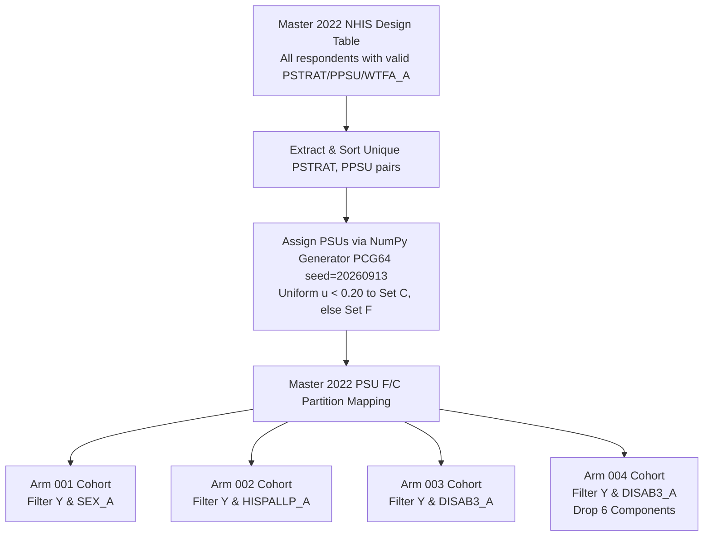

# Data and Method Contracts Specification (Benchmark V1 - B0-R1 Revision)

**Document ID**: `docs/plans/fairbias_benchmark_b0_r1_20260914/DATA_AND_METHOD_CONTRACTS.md`  
**Execution Timestamp**: `2026-09-14T15:55:00+08:00`  
**Active Gate**: `FAIRBIAS-BENCHMARK-B0-R1`  
**Authority Reference**: [Master Plan](file:///Users/lkc/Downloads/code_v_0_3/docs/plans/FAIRBIAS_PRIMARY_BENCHMARK_MASTER_PLAN_20260913.md) | [Supervisor Review of B0](file:///Users/lkc/Downloads/code_v_0_3/docs/reports/FAIRBIAS_B0_SUPERVISOR_REVIEW_20260914.md) | [features.json](file:///Users/lkc/Downloads/code_v_0_3/configs/nhis/features.json)  
**Supervisor**: Codex Supervisor  
**Implementation Worker**: Gemini Implementation Worker  

---

## 1. Experimental Arms Specification

The benchmark evaluates healthcare barrier identification models across four explicitly defined experimental arms:

| Arm ID | Protected Dimension ($A$) | Number of Groups & Expected Categories | Feature Set Name | Feature Count | Scientific Purpose & Boundary |
|---|---|---|---|---|---|
| **Arm 001** | `SEX_A` | 2 expected groups:<br>• `1` = Male<br>• `2` = Female | `primary_core` | 21 semantic features | Primary binary demographic equity benchmark. Baseline axis for comparison against historical literature. |
| **Arm 002** | `HISPALLP_A` | 7 expected groups:<br>• `01` = Hispanic<br>• `02` = NH White only<br>• `03` = NH Black only<br>• `04` = NH Asian only<br>• `05` = NH AIAN only<br>• `06` = NH AIAN and any other<br>• `07` = NH Other and multiple | `primary_core` | 21 semantic features | Multi-group fairness evaluation. Tests algorithmic capability under severe sample imbalance and small-cell minority estimation. |
| **Arm 003** | `DISAB3_A` | 2 expected groups:<br>• `1` = With disability<br>• `2` = Without disability | `primary_core` (full) | 21 semantic features | Health disparity benchmark including 6 explicit disability component proxy variables. |
| **Arm 004** | `DISAB3_A` | 2 expected groups:<br>• `1` = With disability<br>• `2` = Without disability | `primary_core` (exclude components) | 15 semantic features | Feature-ablation sensitivity arm. Evaluates performance when 6 disability component proxies are removed from feature set. |

### Crucial Methodological Invariants for Arms 003 & 004
1. **Identical Population & Partitions**: Arm 004 is **NOT** a restricted subpopulation analysis of persons with disabilities. 
2. **Strict Cohort Parity**: Arm 003 and Arm 004 must have identical respondent rows, identical temporal partitions (F, C, S, T), identical survey weights (`WTFA_A`), and identical design strata (`PSTRAT`, `PPSU`).
3. **Exact Feature Difference**: The only difference between Arm 003 and Arm 004 is the exclusion of the 6 constituent disability component features (`visiondf_a`, `hearingdf_a`, `diff_a`, `comdiff_a`, `uppslfcr_a`, `cogmemdff_a`).

---

## 2. Variables, Missingness & Encoding Contracts

### 2.1 Outcomes
- **Primary Outcome**: `MEDDL12M_A` ("During the past 12 months, delayed medical care because of cost").
  - Substantive Coding: `1` (Yes) $\to 1$; `2` (No) $\to 0$.
  - Invalidation: Non-substantive codes (`7` Refused, `8` Not Ascertained, `9` Don't Know) are excluded from the analysis cohort during initial eligibility filtering.
- **Secondary Outcome (Reserved Extension)**: `MEDNG12M_A` ("During the past 12 months, needed medical care but did not get it due to cost").
  - Substantive Coding: `1` $\to 1$; `2` $\to 0$.

### 2.2 Predictor Semantic Features (21 Primary Core - Statically Extracted from `configs/nhis/features.json`)

| Harmonized Name | Official Name | Domain | Semantic Type | Substantive Codes | Missing Codes | Year Available | Study Role | Imputation on F | Output Representation |
|---|---|---|---|---|---|---|---|---|---|
| `agep_a` | `AGEP_A` | Demographics | Continuous | `18..85` (top-coded at 85) | `97, 98, 99` | 2022, 2023, 2024 | Predictor | Median on F | `MinMaxScaler` on F |
| `pcnt18uptc` | `PCNT18UPTC` | Demographics / Household | Count | `1, 2, 3` (top-coded at 3) | None | 2022, 2023, 2024 | Predictor | Median on F | `MinMaxScaler` on F |
| `pcntlt18tc` | `PCNTLT18TC` | Demographics / Household | Count | `0, 1, 2, 3` (top-coded at 3) | None | 2022, 2023, 2024 | Predictor | Median on F | `MinMaxScaler` on F |
| `educp_a` | `EDUCP_A` | Demographics / Education | Ordinal | `1..10` | `97, 98, 99` | 2022, 2023, 2024 | Predictor | Explicit `'MISSING'` | One-Hot on F |
| `region` | `REGION` | Demographics | Categorical Nominal | `1, 2, 3, 4` | None | 2022, 2023, 2024 | Predictor | Explicit `'MISSING'` | One-Hot on F |
| `ratcat_a` | `RATCAT_A` | Socioeconomic Status | Ordinal | `1..14` | `98` | 2022, 2023, 2024 | Predictor | Explicit `'MISSING'` | One-Hot on F |
| `empwrklsw1_a` | `EMPWRKLSW1_A` | Employment | Categorical Binary | `1, 2` | `7, 8, 9` | 2022, 2023, 2024 | Predictor | Explicit `'MISSING'` | One-Hot on F |
| `empwrkft1_a` | `EMPWRKFT1_A` | Employment | Categorical Binary | `1, 2` | `7, 8, 9` | 2022, 2023, 2024 | Predictor | Explicit `'MISSING'` | One-Hot on F |
| `notcov_a` | `NOTCOV_A` | Health Insurance | Categorical Binary | `1, 2` | `7, 8, 9` | 2022, 2023, 2024 | Predictor | Explicit `'MISSING'` | One-Hot on F |
| `phstat_a` | `PHSTAT_A` | Health Status | Ordinal | `1..5` | `7, 8, 9` | 2022, 2023, 2024 | Predictor | Explicit `'MISSING'` | One-Hot on F |
| `hypev_a` | `HYPEV_A` | Chronic Conditions | Categorical Binary | `1, 2` | `7, 8, 9` | 2022, 2023, 2024 | Predictor | Explicit `'MISSING'` | One-Hot on F |
| `chlev_a` | `CHLEV_A` | Chronic Conditions | Categorical Binary | `1, 2` | `7, 8, 9` | 2022, 2023, 2024 | Predictor | Explicit `'MISSING'` | One-Hot on F |
| `dibev_a` | `DIBEV_A` | Chronic Conditions | Categorical Binary | `1, 2` | `7, 8, 9` | 2022, 2023, 2024 | Predictor | Explicit `'MISSING'` | One-Hot on F |
| `asev_a` | `ASEV_A` | Chronic Conditions | Categorical Binary | `1, 2` | `7, 8, 9` | 2022, 2023, 2024 | Predictor | Explicit `'MISSING'` | One-Hot on F |
| `visiondf_a` | `VISIONDF_A` | Disability Component | Ordinal | `1..4` | `7, 8, 9` | 2022, 2023, 2024 | Predictor (Excluded in Arm 004) | Explicit `'MISSING'` | One-Hot on F |
| `hearingdf_a` | `HEARINGDF_A` | Disability Component | Ordinal | `1..4` | `7, 8, 9` | 2022, 2023, 2024 | Predictor (Excluded in Arm 004) | Explicit `'MISSING'` | One-Hot on F |
| `diff_a` | `DIFF_A` | Disability Component | Ordinal | `1..4` | `7, 8, 9` | 2022, 2023, 2024 | Predictor (Excluded in Arm 004) | Explicit `'MISSING'` | One-Hot on F |
| `comdiff_a` | `COMDIFF_A` | Disability Component | Ordinal | `1..4` | `7, 8, 9` | 2022, 2023, 2024 | Predictor (Excluded in Arm 004) | Explicit `'MISSING'` | One-Hot on F |
| `uppslfcr_a` | `UPPSLFCR_A` | Disability Component | Ordinal | `1..4` | `7, 8, 9` | 2022, 2023, 2024 | Predictor (Excluded in Arm 004) | Explicit `'MISSING'` | One-Hot on F |
| `cogmemdff_a` | `COGMEMDFF_A` | Disability Component | Ordinal | `1..4` | `7, 8, 9` | 2022, 2023, 2024 | Predictor (Excluded in Arm 004) | Explicit `'MISSING'` | One-Hot on F |
| `usualpl_a` | `USUALPL_A` | Health Care Access | Categorical Nominal | `1, 2, 3` | `7, 8, 9` | 2022, 2023, 2024 | Predictor | Explicit `'MISSING'` | One-Hot on F |

*Terminology Notes*:
- `PCNT18UPTC` and `PCNTLT18TC` represent the number of adults and children in the **household** (official CDC codebook description).
- `URBRRL` (2013 NCHS Urban-Rural classification) is excluded by feature selection policy; it is an administrative geographic covariate, not a complex survey design variable (strata/PSUs are governed strictly by `PSTRAT` and `PPSU`).

### 2.3 Categorical Encoding & Vocabulary Reservation Contract
- **The Defect of Plain `handle_unknown='ignore'`**: When standard `OneHotEncoder(handle_unknown='ignore')` encounters an unobserved category in test data, it encodes the record as an all-zeros row across all category columns for that feature. This causes unobserved categories to be conflated with zero-indicators and prevents the downstream model from learning an explicit unknown category behavior.
- **Benchmark V1 Contract**:
  1. The semantic layer maps all non-substantive/missing values to an explicit token string `'MISSING'`.
  2. In addition, an explicit reserved token `'UNKNOWN'` is added to the categorical level definitions established on Partition F.
  3. When fitting `OneHotEncoder` on Partition F, the encoder vocabulary for each categorical feature is explicitly constructed from:
     $$\mathcal{V}_{\text{feature}} = \text{Substantive\_Levels}(F) \cup \{\text{'MISSING'}, \text{'UNKNOWN'}\}$$
  4. During inference on Set S or Set T, any category level not present in the substantive levels of F is mapped to `'UNKNOWN'`, ensuring it activates the dedicated `'UNKNOWN'` column.
  5. The category vocabulary is frozen on F; under no circumstances may S or T expand the vocabulary.
- **Continuous Imputation & Out-of-Bounds Policy**:
  - Continuous variables (`agep_a`, `pcnt18uptc`, `pcntlt18tc`) are imputed using medians computed strictly on Partition F. If an entire continuous column is missing on F, the pipeline fails closed with `FeatureImputationError`.
  - Continuous values in S or T exceeding the range observed in F are scaled linearly using the frozen `MinMaxScaler` (without clipping, preserving linear properties; clipping is treated as a distinct ablation if required).
  - Consolidated categorical levels (e.g. from FairBias grouping) produce an updated feature schema recording merged levels.

---

## 3. Master Partitioning Architecture: F / C / S / T

To prevent cross-round and cross-temporal leakage, data partitioning follows a strict sequential pipeline:



### 3.1 Step-by-Step Execution Order
1. **Step 1: Construct 2022 Master Survey Design Table**:
   - Load all respondent records from 2022 possessing valid administrative design variables (`WTFA_A > 0`, `PSTRAT`, `PPSU`).
   - Do NOT filter by outcome $Y$ or demographic attribute $A$ at this stage.
2. **Step 2: Generate Master PSU Allocation Mapping**:
   - Extract the set of unique `(PSTRAT, PPSU)` clusters present in the 2022 master design table.
   - Sort the clusters in ascending order by integer tuple: `(int(PSTRAT), int(PPSU))`.
   - Initialize a reproducible pseudo-random number generator:
     ```python
     import numpy as np
     rng = np.random.Generator(np.random.PCG64(20260913))
     ```
   - For each sorted cluster $j$, draw a uniform random variate $u_j = \text{rng.uniform}(0.0, 1.0)$.
   - Assign cluster $j$ to **Calibration Set C** if $u_j < 0.20$; otherwise assign to **Fitting Set F**.
   - Store the resulting cluster-to-partition mapping table and compute its SHA-256 hash.
   - Invariant: Every PSU cluster is assigned atomically. No PSU is ever split between F and C.
3. **Step 3: Apply Arm-Specific Eligibility Masks**:
   - For each experimental arm (Arms 001–004), filter records that have substantive values for $Y$ (`MEDDL12M_A` in $\{1, 2\}$) and substantive values for that arm's protected attribute $A$.
   - The master F/C assignment determined in Step 2 is inherited directly by each eligible respondent.
4. **Step 4: Selection Set S (2023) & Frozen Evaluation Set T (2024)**:
   - 2023 eligible cohort constitutes 100% of **Selection Set S** (used exclusively for candidate configuration selection).
   - 2024 eligible cohort constitutes 100% of **Evaluation Set T** (locked until Gate B6; used strictly for frozen forward inference).

---

## 4. Stable Record Identity Contract

To guarantee cross-partition isolation and prevent entity leakage, every respondent record possesses a strictly normalized, immutable identity key:

### 4.1 Key Specification
$$\text{record\_key} = \text{source} + \text{":"} + \text{str}(\text{int}(\text{year})) + \text{":"} + \text{id\_norm}$$
- `source`: String identifier of the dataset (e.g. `'nhis'`).
- `year`: Finite integer calendar survey year (`2022`, `2023`, `2024`). Floating-point representations (`2023.0`) are canonicalized to integer `2023`. Non-integers, `NaN`, and `inf` are strictly rejected.
- `id_norm`: Normalized string identifier based on the official survey record ID `HHX` (+ person index where applicable). RangeIndex or positional line numbers after filtering are strictly forbidden as record identifiers.

### 4.2 Partition Data Structure Schema
Every partition object returned by benchmark data loaders conforms to the following dictionary contract:
```python
{
    "record_key": np.ndarray[str],        # Unique normalized record identifiers, shape (N,)
    "X_semantic": pd.DataFrame,           # 21 (or 15) raw semantic features, shape (N, P)
    "y": np.ndarray[int],                 # Binary outcome labels in {0, 1}, shape (N,)
    "A": np.ndarray[int],                 # Protected attribute categories, shape (N,)
    "WTFA_A": np.ndarray[float],          # Finite, non-negative sampling weights, shape (N,)
    "PSTRAT": np.ndarray[int],            # Complex survey variance stratum, shape (N,)
    "PPSU": np.ndarray[int],              # Complex survey variance PSU, shape (N,)
    "year": int,                          # Survey year (2022, 2023, or 2024)
    "role": str,                          # 'fitting_F', 'calibration_C', 'selection_S', 'evaluation_T'
    "eligibility_mask": np.ndarray[bool], # Boolean array indicating cohort inclusion, shape (N,)
    "schema_hash": str,                   # SHA-256 hash of feature schema configuration
    "source_hash": str,                   # SHA-256 hash of raw data source
}
```

---

## 5. Method Input/Output & Capability Matrix

The benchmark evaluates 7 core methods across Logistic Regression (LR) and Gradient Boosting (`GradientBoostingClassifier`) backbones. Every adapter must declare its capabilities explicitly:

| Method ID | Literature Reference | Modifies $X$? | Modifies Weights? | Requires $y$ at fit? | Requires $A$ at fit? | Requires $A$ at predict? | Supports Arm 002 (HISP 7-group)? | Supports Survey Training Weights? | Stochastic Fit / Decision? | Output Type Contract | Native Objective | Verification Status |
|---|---|---|---|---|---|---|---|---|---|---|---|---|
| **UNMITIGATED** | Standard Classifier | No | No | Yes | No | No | **Supported** | Supported (sensitivity) | Deterministic / Deterministic | Event prob $p$, Hard decision | Log-loss / Deviance | `UNVERIFIED (pending B3)` |
| **FAIRBIAS_BM** | Tang et al. (2024) application-v1 | Yes (Greedy BM) | No | **Yes (NMI gate & classifier)** | Yes | No | **Supported** (requires B3 multi-group test) | Supported (downstream) | Stochastic MDS / Deterministic | Event prob $p$, Hard decision | Min $d_\phi$ geometry s.t. NMI gate | `UNVERIFIED (pending B3)` |
| **REWEIGHING** | Kamiran & Calders (2012) AIF360 | No | Yes (Sample weights $W_{\text{fair}}$) | Yes | Yes | No | **Supported** (multi-group) | `NOT_SUPPORTED` | Deterministic / Deterministic | Event prob $p$, Hard decision | Parity reweighted log-loss | `UNVERIFIED (pending B3)` |
| **LFR_RECONSTRUCTED** | Zemel et al. (2013) AIF360 | Yes (Prototype representations) | No | Yes | Yes | Yes (API requirement) | **`NOT_SUPPORTED`** | `NOT_SUPPORTED` | Stochastic / Deterministic | Downstream $p$, Hard decision | Reconstruction + Fair loss | `UNVERIFIED (pending B3)` |
| **EG_DP** | Agarwal et al. (2018) Fairlearn | No | Yes (Reduction oracle costs) | Yes | Yes | No | **Supported** | `NOT_SUPPORTED` | Deterministic / **Stochastic $q$** | Decision prob $q$ | Error rate s.t. DP | `UNVERIFIED (pending B3)` |
| **EG_EO** | Agarwal et al. (2018) Fairlearn | No | Yes (Reduction oracle costs) | Yes | Yes | No | **Supported** | `NOT_SUPPORTED` | Deterministic / **Stochastic $q$** | Decision prob $q$ | Error rate s.t. EO | `UNVERIFIED (pending B3)` |
| **TO_EO** | Hardt et al. (2016) Fairlearn | No | No | Yes | Yes | **Yes** | **Supported** (requires positive support) | `NOT_SUPPORTED` | Deterministic / **Stochastic $q$** | Decision prob $q$, Base $p$ | Balanced Acc s.t. EO | `UNVERIFIED (pending B3)` |

### 5.1 FairBias-BM API & Algorithm Identity Specification (Addressing R01)
1. **Supervised Fit Requirement**:
   - In `src/fairbias/mitigation.py`, the baseline NMI information-loss gate `_nmi_gate_ok(transformed_df, Y, nmi_org, attr)` (lines 212–224) explicitly calculates mutual information between candidate transformed features and ground-truth labels $Y$ (`normalized_mutual_info_score(y, col_vals)`).
   - `_make_candidate()` (line 271) evaluates this gate before accepting any candidate transformation.
   - Therefore, `FairBias-BM.fit()` **requires $y$**. Downstream supervised classifiers also require $y$.
   - During inference, `FairBias-BM.predict()` applies the frozen transformations learned on F and strictly does **NOT** access $y$.
2. **Itemized Algorithmic Mapping**:
   - Cardinality $H$: Fixed at $H=1$ (single companion feature), mapped to `src/fairbias/mitigation.py:175`.
   - MDS Dimensionality Selection: Evaluated via stress-elbow heuristic, mapped to `src/fairbias/bias_metric.py:431`.
   - Power Sequence Grid: Interleaved power sequences `[1, 2, 0.5, 3, 0.33, 4, 0.25, 5, 0.2]` mapped to `src/fairbias/enhancement.py:DEFAULT_POLY_GRID`.
   - Restart / Revisit Strategy: Mapped to `src/fairbias/mitigation.py:320`.
   - Information Gate: NMI gate mapped to `src/fairbias/mitigation.py:212, 271`.
   - Multi-Group Aggregation: Maximum pair divergence across demographic categories mapped to `src/fairbias/bias_metric.py:165`.
   - Epsilon Reference: Computed strictly on Partition F semantic representation.
   - Stopping Criteria & Budgets: Terminate on first feasible candidate or budget exhaustion, mapped to `src/fairbias/mitigation.py:360`.
3. **Fidelity Status Designation**:
   - Formally designated as `FairBias-BM application-v1 (fidelity UNVERIFIED, pending Gate B3)`. All specific citations to original publication venue or line-level fidelity claims are marked `SOURCE_UNVERIFIED` until verified against authoritative publisher texts during Gate B3.

### 5.2 Crucial Adapter Execution Contracts for External Methods
1. **LFR Label & Score Isolation**:
   - AIF360 `LFR.transform()` modifies the `labels` and `scores` fields of `BinaryLabelDataset`.
   - Contract: Original ground-truth labels $y$ must be maintained in an isolated array and never overwritten by LFR transformed labels.
   - Inference Contract: Dummy placeholder labels passed during inference must be proven to have zero influence on transformed continuous representations.
2. **Reweighing (RW) Factor & Index Preservation**:
   - AIF360 `Reweighing.fit_transform()` returns a tuple `(X_trans, sample_weights)`.
   - Contract: `sample_weights` represents fairness balancing factors $W_{\text{fair}}$, completely separate from sampling weights $W_{\text{survey}}$. The record key index must be preserved intact.
3. **Exponentiated Gradient (EG) Oracle Routing & Decision Probability $q$**:
   - Contract: Oracle cost weights generated during reductions must be routed directly to base estimators supporting `sample_weight`.
   - Contract: Output decision probability $q_i = \sum_m \beta_m h_m(x_i)$ is computed from the mixture of base classifier **hard decisions**, not continuous probabilities. $q$ represents randomized decision policy and must never be disguised as event risk $p$.
4. **ThresholdOptimizer (TO) Calibration Contract**:
   - Contract: Fitted exclusively on Set C with `prefit=True` and `predict_method='predict_proba'`.
   - Contract: Requires $A$ at prediction time. Unseen or missing $A$ levels must raise explicit exceptions rather than falling back to uncalibrated thresholds.

---

## 6. Explicit NOT_SUPPORTED Boundary Register

Any execution script or configuration requesting the following combinations must fail closed with status `NOT_SUPPORTED`:
1. **LFR on Arm 002 (`HISPALLP_A` 7 groups)**:
   - AIF360 LFR is mathematically and architecturally implemented for binary protected attributes (single privileged group vs single unprivileged group).
   - Splitting or binarizing 7 groups into White vs Non-White is strictly prohibited.
   - Status: `NOT_SUPPORTED`. This condition cell is retained in the benchmark matrix as an explicit structural void with scientific justification.
2. **Complex Survey Weighted Training for EG, TO, and LFR**:
   - Upstream library implementations do not support simultaneous survey design weights and fairness constraint weights.
   - Merging or multiplying survey weights into fairness reduction weights without mathematical formulation is prohibited.
   - Status: `NOT_SUPPORTED`.
