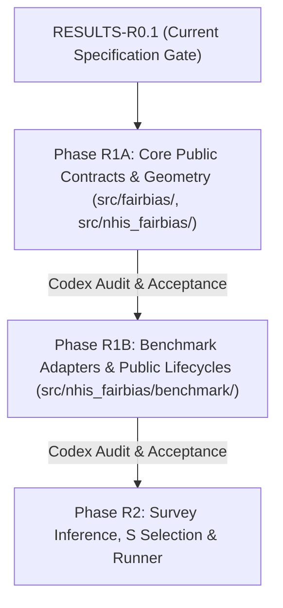

# R1 EXECUTABLE SPECIFICATION: Staged Implementation Plan for Core Contracts (R1A) and Benchmark Adapters (R1B)

- **Date**: 2026-09-14
- **Author**: Gemini Implementation Worker
- **Governing Protocol**: `docs/AI_EXECUTION_PROTOCOL.md` (Sections 3, 5, 7, 8, 9)
- **Supervisory Audit Reference**: `docs/reports/FAIRBIAS_RESULTS_R0_SUPERVISOR_REVIEW_20260914.md`
- **Current Gate**: **RESULTS-R0.1 (Targeted Remediation & Executable Specification)**
- **Status of Gates R1A & R1B**: **PLANNED / NOT ACTIVATED / NOT RUN**
- **Single Source of Truth**: `docs/plans/fairbias_benchmark_results_r0_1_20260914_115630Z_27761157/FACTS.json`
- **Condition Registry**: `docs/plans/fairbias_benchmark_results_r0_1_20260914_115630Z_27761157/CONDITION_REGISTRY.json`

---

## 1. Architectural Architecture & Staged Separation

In response to Supervisory Finding R01, implementation Phase R1 is bifurcated into two strictly sequential, independently audited sub-phases:
1. **Phase R1A (Core Public Contracts & Geometry Configuration Propagation)**: Remediates underlying legacy flaws (C01–C06, E01) within the core library (`src/fairbias/` and `src/nhis_fairbias/`) and validates algorithmic geometry propagation.
2. **Phase R1B (FairBias & Comparator Adapter Implementation)**: Rewrites benchmark adapters, metrics, data contracts, and preprocessing (`src/nhis_fairbias/benchmark/`) on synthetic cohorts.



---

## 2. Phase R1A: Core Public Contracts & Geometry Configuration Propagation

### 2.1 Scope & File Modification Allowlist
Phase R1A resolves legacy architectural defects at their root definitions. Modifying adapter wrappers does not close these issues.

| Defect ID | Target Source File | Exact Class / Function Scope | Core Remediation vs. Application Isolation | Acceptance Criteria & Counterexample Test Probes |
|---|---|---|---|---|
| **C01** | `src/fairbias/enhancement_state.py`<br>`src/fairbias/enhancement.py`<br>`src/fairbias/enhancement_contracts.py`<br>`src/nhis_fairbias/d8_enhancement_runner.py` | `EnhancementState.compute_state_id()`<br>`FairnessEnhancementEngine._evaluate_candidate()`<br>`ScientificConfig.fingerprint()` | **Core Remediation**: Replace 8-decimal float truncation with lossless exact representation (`repr()` / exact rational). Invalidate cache when estimator hyperparameters change (e.g., LR $C=1 \to 2$). Retain explicit `v1` legacy mode for historical regression. | **Probe C01-A**: Synthetic state with power `3.000000001` vs `3.000000002` must yield distinct state IDs.<br>**Probe C01-B**: Modifying `estimator.C` must invalidate cached candidate utilities. |
| **C02** | `src/nhis_fairbias/adapter.py`<br>`src/nhis_fairbias/preprocessing.py` | `NHISFairBiasAdapter._validate_prefitted_registry()`<br>`NHISPreprocessor.validate_schema()` | **Core Remediation**: Inspect actual `.registry` attribute (not non-existent `.feature_registry`) and actual schema keys. Reject altered semantic configurations. | **Probe C02-A**: Prefitted preprocessor matching schema accepted.<br>**Probe C02-B**: Mutated category mapping for `AGEP_A` strictly rejected with `SchemaMismatchError`. |
| **C03** | `src/fairbias/enhancement_contracts.py` | `RecordKeyValidator.validate()`<br>`make_canonical_record_key()` | **Core Remediation**: Enforce strict integer years ($[2022, 2024]$). Reject floats (`2023.0`, `2023.9`) and booleans (`True`). Preserve leading zeros in string identifiers. Reject positional index fallback. | **Probe C03-A**: `year=2023.0` raises `TypeError`.<br>**Probe C03-B**: Identical features across different source years do not collide. |
| **C04** | `src/fairbias/enhancement_contracts.py`<br>`src/nhis_fairbias/d8_enhancement_runner.py` | `ProbabilityContractValidator.validate()` | **Core Remediation**: Verify binary labels, locate positive class via `classes_`, assert 2D shape, finite values in $[0, 1]$, and row sums equal to 1.0. | **Probe C04-A**: Probabilities with inverted `classes_=[1, 0]` mapped correctly to positive class.<br>**Probe C04-B**: Probabilities outside $[0, 1]$ or summing to $\ne 1.0$ raise `ValueError`. |
| **C05** | `src/fairbias/bias_metric.py` | `compute_dphi()`<br>`_categorical_divergence()` | **Core Remediation**: Define support set $K$ strictly by empirical positive support in sample. Unobserved categories (zero counts / zero weights) do not alter divergence. | **Probe C05-A**: Synthetic vector $c = [0, 1]$ divergence must equal $1.0$, and must remain $1.0$ if pandas Categorical categories are expanded to $[0, 1, 2]$. |
| **C06** | `src/fairbias/evaluator.py`<br>`src/fairbias/bias_metric.py` | `FairEvaluator.evaluate()`<br>`compute_dphi_matrix()` | **Core Remediation**: Disambiguate multi-group aggregation. Standardize extreme-gap definition ($max - min$) and distinguish from legacy mean pairwise disparity. Return `NOT_ESTIMABLE` for missing groups. | **Probe C06-A**: Single-group input returns `d_phi = None` (`NOT_ESTIMABLE`).<br>**Probe C06-B**: Multi-group gap computed over 7 expected groups evaluates extreme difference. |
| **E01** | `src/nhis_fairbias/survey.py` | `SurveyProportionValidator.validate()`<br>`weighted_proportion()` | **Core Remediation**: Guard against weight sum overflow. Normalize weights by maximum or mean before aggregation. Validate finite outputs. | **Probe E01-A**: Two observations with weights `1e308` each must evaluate proportion to $0.5$ (or fail closed); must never evaluate to $0.0$. |
| **BM Config** | `src/fairbias/config.py`<br>`src/fairbias/evaluator.py`<br>`src/fairbias/mitigation.py` | `FairnessMitigationEngine.fit()`<br>`FairEvaluator.compute_dphi_matrix()` | **Core Remediation**: Pass multi-group aggregation mode into `compute_dphi_matrix`. Bind effective geometric parameters and hash. Define application profiles. | **Probe BM-A**: Verify multi-group aggregation parameter reaches `compute_dphi_matrix`.<br>**Probe BM-B**: Verify application profile allows strict AE/Joint execution without mutating paper-mode invariants. |

### 2.2 Algorithmic Rules for FairBias-BM
1. **$H=1$ Context**: Contexts holding at most one attribute constant are formed per `bias_metric.py:99` and `mitigation.py:175`.
2. **Author Interleaved Power Stream**: The optimization iterates over the exact sequence $[3, 1/3, 5, 1/5, \dots, 1999, 1/1999]$ (`config.py:79`). The 6-value `DEFAULT_POLY_GRID` is restricted to AE heuristic search.
3. **Restart Revisit**: If no candidate power reduces geometric disparity $\mathcal{D}_\Phi$ in a pass, the search triggers a restart pass over unvisited features before terminating.
4. **NMI Utility Gating**: At each candidate step, the mutual information $NMI(X_{\text{trans}}, y)$ must not degrade below $\tau_{\text{NMI}} \cdot NMI(X_{\text{orig}}, y)$ on Partition F.
5. **Multi-Group Disparity Metric**: Evaluator must distinguish:
   - Max pairwise absolute difference: $\max_{g_1, g_2} |v_{g_1} - v_{g_2}|$.
   - Difference of group extrema: $|\max_{g} v_g - \min_{g} v_g|$.
   The selected formula must be explicit in configuration and test-verified.
6. **Valid Terminal States**:
   - `OPTIMAL_CONVERGENCE`: $\mathcal{D}_\Phi \le \epsilon$.
   - `NO_TRANSFORM_REQUIRED`: Dataset already satisfies constraint at baseline ($\mathcal{D}_\Phi \le \epsilon$).
   - `BUDGET_EXHAUSTED`: Maximum iterations ($50$) or geometric evaluations ($20,000$) reached.
   - `NO_FEASIBLE_CANDIDATE`: Candidates exhausted without satisfying $\mathcal{D}_\Phi \le \epsilon$.

---

## 3. Phase R1B: FairBias & Comparator Adapter Implementation

### 3.1 Scope & File Modification Allowlist
Phase R1B implements clean public interfaces, strict lifecycle boundaries, and statistical contracts for the benchmark suite.

| Target File | Modifications & Contract Responsibilities |
|---|---|
| `src/nhis_fairbias/benchmark/adapters/adapter_fairbias.py` | 1. Remove D6 disk loading (`frozen_changed_dict.json`) and hardcoded fallback dictionaries.<br>2. Call genuine BM manifold engine on Partition F (`X_F, y_F, A_F`).<br>3. Fix array fallback: apply learned transformations before classifier fitting and inference.<br>4. Treat identity / no-op as a valid state (`NO_TRANSFORM_REQUIRED`).<br>5. Decouple $p$, $q$, and $\hat{y}$. |
| `src/nhis_fairbias/benchmark/adapters/base.py` | Define explicit base methods: `predict_proba()` $\to p$, `predict()` $\to \hat{y}$ (thresholded), `predict_decision_proba()` $\to q$ (randomized policy only; raise error or return None for deterministic). |
| `src/nhis_fairbias/benchmark/adapters/adapter_unmitigated.py` | Fit on Partition F. Implement thresholded `predict` using Set C threshold $t^*$. Return $p$ via `predict_proba`. |
| `src/nhis_fairbias/benchmark/adapters/adapter_reweighing.py` | Fit Kamiran & Calders sample weights on Partition F. Use Set C thresholding for $\hat{y}$. Return $p$ via `predict_proba`. |
| `src/nhis_fairbias/benchmark/adapters/adapter_lfr.py` | Fit latent representation and downstream LR on Partition F under full budget. Arm 002 returns `NOT_SUPPORTED`. Use Set C thresholding for $\hat{y}$. Return $p$ via `predict_proba`. |
| `src/nhis_fairbias/benchmark/adapters/adapter_reductions.py` | Decouple `difference_bound` from optimization `eps`. Reject unsupported external survey weights with `NotSupportedError`. Route internal reduction weights to base estimator. Return policy $q$ via `predict_decision_proba`. |
| `src/nhis_fairbias/benchmark/adapters/adapter_threshold_optimizer.py` | Align parameter signature `sample_weight`. Enforce two-stage fit: base model on F, postprocessor on C. Reject unified fit without disjoint C. Preserve specific `ValueError` exceptions. |
| `src/nhis_fairbias/benchmark/metrics.py` | Enforce multi-group completeness: if any expected group lacks positive/negative support, return `eo_gap: None` with status `NOT_ESTIMABLE`. Decouple deterministic confusion matrix evaluation from soft policy evaluation. Add $p$-based evaluators (AUROC, AP, Brier). |
| `src/nhis_fairbias/benchmark/preprocessing.py` | Perform semantic cleaning before Partition F fitting. Drop all-missing numeric features per schema rules instead of filling 0.0. Map nulls to `MISSING` before string conversion. |
| `src/nhis_fairbias/benchmark/data_contracts.py` | Enforce integer year validation. Construct master PSU assignments on full 2022 design before applying domain masks. Fail closed if record identifiers are missing. |
| `tests/benchmark/test_r1_algorithm_contracts.py` (NEW) | Comprehensive synthetic acceptance test suite covering all R1B requirements. |

### 3.2 Public Lifecycle State Machine
Every benchmark model executes through the following strict state progression:
```text
[Raw Input]
     │
     ▼
1. Semantic Preprocessing (Source-defined cleaning; F-only vocabulary and medians)
     │
     ▼
2. Partition F Fitting (Imputers, Scalers, BM Manifold, Reweighting, Base Classifiers)
     │
     ▼
3. Partition C Calibration (Deterministic models: global threshold t*; TO: postprocessor calibration)
     │
     ▼
4. Model State Freeze (Immutable serialization of feature maps, classifiers, and thresholds)
     │
     ▼
5. Partition S Selection (Evaluation across hyperparameter candidates; selection of winning config)
     │
     ▼
6. Partition T Evaluation (Unadjusted evaluation on frozen winning model; zero fitting/tuning permitted)
```

### 3.3 Strict Output Decoupling ($p$, $q$, $\hat{y}$)
1. **Risk Probability ($p \in [0, 1]$)**: Emitted by `predict_proba[:, 1]`. Evaluated for:
   - Area Under ROC Curve (AUROC)
   - Weighted Average Precision (AP)
   - Brier Score
   - Calibration Curve
2. **Deterministic Classification ($\hat{y} \in \{0, 1\}$)**:
   - For Unmitigated, FairBias, Reweighing, and LFR: $\hat{y} = \mathbb{I}(p \ge t^*)$, where $t^*$ is calibrated on Partition C.
   - Evaluated for: Balanced Accuracy ($BA$), Equalized Odds Gap ($EO$), Demographic Parity Gap ($DP$), True Positive Rate ($TPR$), False Positive Rate ($FPR$).
3. **Randomized Decision Policy ($q \in [0, 1]$)**:
   - Emitted exclusively by Exponentiated Gradient (`EG_DP`, `EG_EO`) and ThresholdOptimizer (`TO_EO`) via `predict_decision_proba`.
   - Represents the exact probability of positive assignment under the randomized mixture policy.
   - Evaluated for expected confusion metrics: $TP = \sum w \cdot y \cdot q$, $FP = \sum w \cdot (1-y) \cdot q$.
   - **Prohibition**: $q$ must never be reported as predicted clinical risk $p$, nor entered into Brier/AUROC calculations.

### 3.4 Partition C Threshold Freezing Protocol
For all probabilistic models (Unmitigated, FairBias, RW, LFR), the global threshold $t^*$ is calibrated on Partition C according to Master Plan Section 5.1:
1. Candidate thresholds $T$ comprise:
   - $0.0$ and $1.0$.
   - Midpoints between all distinct sorted values of predicted probabilities $p_C$:
     $$t_i = \frac{p_{(i)} + p_{(i+1)}}{2}$$
2. Optimal threshold $t^*$ maximizes unweighted Balanced Accuracy on Set C:
   $$t^* = \arg\max_{t \in T} BA(y_C, \mathbb{I}(p_C \ge t))$$
3. Ties are broken by:
   - Minimal distance to $0.5$: $|t - 0.5|$.
   - Selecting the larger threshold $t$.
4. The calibrated $t^*$ is frozen and transferred to Partition S and Partition T without adjustment.

---

## 4. Execution Commands, Interpreters & Runtime Access Guard

### 4.1 Verified Python Interpreters
- **Primary Framework Interpreter**:
  - Path: `/Library/Frameworks/Python.framework/Versions/3.13/bin/python3`
  - Verified Installed Dependencies: `scipy 1.16.1`, `numpy 2.2.6`, `scikit-learn 1.7.1`, `pandas 2.3.1`, `xgboost 3.4.1`, `pytest 8.4.1`.
  - **Usable for**: Phase R1A (all core contract tests) and Phase R1B synthetic tests for Unmitigated, FairBias, and Reweighing.
- **Dependency Blockage Disclosure for R1B**:
  - Neither system interpreter nor framework interpreter currently has `fairlearn` or `aif360` installed.
  - In accordance with Protocol Section 6, the worker **shall not install packages or create virtual environments without supervisor authorization**.
  - During Phase R1B, adapter tests requiring Fairlearn or AIF360 must either be executed in an explicitly authorized environment or cleanly report `DEPENDENCY_BLOCKED` without crashing the test harness.

### 4.2 Future Guarded Test Runner Command
When Gate R1 is activated by the Codex supervisor, tests will be executed via the dedicated runner:
```bash
# Future Execution Command for Phase R1A (DO NOT RUN IN RESULTS-R0.1)
/Library/Frameworks/Python.framework/Versions/3.13/bin/python3 \
  scripts/run_fairbias_r1_guarded_tests.py \
  --phase r1a \
  --output-dir /Users/lkc/Downloads/code_v_0_3/runs/r1a_contracts_<TIMESTAMP>

# Future Execution Command for Phase R1B (DO NOT RUN IN RESULTS-R0.1)
/Library/Frameworks/Python.framework/Versions/3.13/bin/python3 \
  scripts/run_fairbias_r1_guarded_tests.py \
  --phase r1b \
  --output-dir /Users/lkc/Downloads/code_v_0_3/runs/r1b_adapters_<TIMESTAMP>
```

### 4.3 Runtime Access Guard Specifications
The test runner installs an in-process security guard before importing pytest or project code:
1. **Network Denial**: Monkeypatch `socket.socket`, `socket.connect`, `urllib.request.urlopen` to raise `PermissionError("Guard: Network access strictly prohibited")`.
2. **Subprocess Denial**: Monkeypatch `subprocess.Popen`, `subprocess.run`, `os.system` to raise `PermissionError("Guard: Subprocess spawning prohibited")`.
3. **File System Read Allowlist**:
   - Authorized: Project root `/Users/lkc/Downloads/code_v_0_3/` under `src/`, `configs/`, `tests/`, `docs/plans/`.
   - Prohibited (Fail-Closed):
     - `data/` (all raw, interim, and processed data).
     - `data_COMPAS.csv`, `data_Credit_Card.csv`.
     - `docs/releases/` (prohibits loading legacy D6 JSON release rules).
     - Individual parquet microdata files.
4. **File System Write Allowlist**:
   - Authorized: Strictly the specified `--output-dir` and temporary test fixtures.
5. **Sentinel Probes**: Before executing test suites, the runner tests the guard by attempting to open a synthetic non-sensitive sentinel path (`/tmp/guard_sentinel_test.tmp`) and verifying interception.

---

## 5. Appendices: Future Phase Roadmaps (R2–R4)

### Appendix A: Phase R2 Specification (Survey Inference, S Selection & Runner)
- **Full Survey Design Preservation**: Domain estimation maintains the full-year $(PSTRAT, PPSU)$ matrix ($N_{\text{full}} \approx 32,600$); domain-ineligible records are zero-weighted ($w \cdot \mathbb{I}_{\text{eligible}}$), preserving original degrees of freedom $df = \sum (n_h - 1)$.
- **Degenerate Variance Handling**: If raw design contains singleton strata or $df \le 0$, return status `DESIGN_NOT_ESTIMABLE`. Do not force $df=1$ or zero variance.
- **Formal Replicate Threshold**: Formal confidence intervals require $B=2,000$ replicates with valid replicate proportion $B_{\text{valid}} / B \ge 0.95$.
- **Pre-Registered 20-Contrast Family**:
  - Primary contrasts evaluate FairBias-BM vs. 5 comparators (`UNMITIGATED`, `REWEIGHING`, `LFR_RECONSTRUCTED`, `EG-EO`, `TO-EO`) on Arm 001 and Arm 003, for $\Delta BA$ and $\Delta EO$:
    $$5 \text{ comparators} \times 2 \text{ metrics} \times 2 \text{ arms} = \mathbf{20} \text{ contrasts}$$
  - Multiplicity correction: Bonferroni-adjusted $\alpha = 0.05 / 20 = 0.0025$. Denominator is fixed at $20$ regardless of individual comparator failures.
  - Report two-sided $p$-values computed via `scipy.stats.t.sf(abs(t), df) * 2`.
- **Set S Within-Method Selection**: For each `(method, arm, backbone)` tuple, evaluate the candidate hyperparameter grid on Set S. Select configuration satisfying fairness budget ($EO \le 0.10$ primary; $0.05, 0.20$ sensitivity) maximizing weighted $BA$. If no candidate satisfies budget, record `NO_FEASIBLE_CONFIGURATION` and select boundary candidate.
- **Memory Optimization**: Chunk bootstrap weight evaluation into batches of $100$ replicates, bounding resident memory to $< 2\text{ GB}$.

### Appendix B: Phase R3 Specification (Full Model Matrix & Development)
- **Standardized Backbones**: Dual backbones for all methods:
  - Primary: `LogisticRegression(C, max_iter=1000, solver='lbfgs')`.
  - Secondary: `sklearn.ensemble.GradientBoostingClassifier(n_estimators, max_depth, learning_rate=0.05)`.
- **Canonical 76 Conditions (Registered in `CONDITION_REGISTRY.json`)**:
  - 54 Core conditions: 27 conditions $\times$ 2 backbones.
  - 16 AE Ablation conditions: 8 FairBias-BM$\to$AE + 8 FairBias-Joint.
  - 4 Survey-Weighted Training conditions: Arm 003 and Arm 004 $\times$ LR $\times$ {Unmitigated, FairBias-BM}.
  - 2 Geometric Path conditions: Arm 004 $\times$ LR $\times$ {FairBias-BM fixed-2D, FairBias-Joint fixed-2D}.
  - 2 Excluded cells: LFR on Arm 002 for LR and GBDT (`NOT_SUPPORTED`).
- **Resource Limits per Fit**: Maximum 30 minutes wall-clock timeout and 4 GiB resident memory. Any condition exceeding limits terminates with status `BUDGET_EXHAUSTED`.
- **Development Authorization Boundary**: Real 2022/2023 data support audit may be initiated only after the full 76-condition synthetic rehearsal passes, and only under explicit supervisor authorization.

### Appendix C: Phase R4 Specification (Post-Freeze Evaluation & Paper)
- **Retrospective 2024 Evaluation**: Models, thresholds, and hyperparameters frozen on Set S are evaluated once on Partition T (2024). Disclosure that 2024 data was inspected during earlier historical exploration is mandatory; no claims of prospective blind validation are permitted.
- **Reporting Standards**:
  - Full transparency: report absolute differences with signs ($\Delta BA$, $\Delta EO$, $\Delta DP$) and 95% confidence intervals. If Reweighing or another comparator dominates FairBias, report the finding unreservedly.
  - Report group-specific TPR, FPR, selection rate, and population counts.
- **Application Paper Framing**: Frame study around identifying cost-related healthcare accessibility barriers under complex survey designs, examining empirical accuracy-fairness tradeoffs across survey years. Avoid clinical triage claims or legal compliance assertions.
