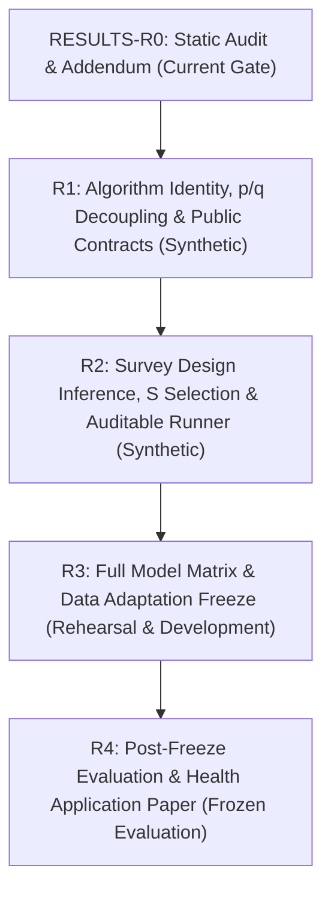

# REPAIR IMPLEMENTATION SPECIFICATION: Staged Remediation Plan (R1–R4) for NHIS FairBias Benchmark

- **Date**: 2026-09-14
- **Author**: Gemini Implementation Worker
- **Governing Protocol**: `docs/AI_EXECUTION_PROTOCOL.md` (Sections 3, 4, 5, 6, 7, 8, 9)
- **Supervisory Audit Reference**: `docs/reports/FAIRBIAS_FULL_BENCHMARK_SUPERVISOR_REVIEW_20260914.md`
- **Current Gate**: **RESULTS-R0 (Static Audit Response & Staged Repair Specification)**
- **Active Branch**: `research/nhis-fairbias`
- **Current HEAD**: `67e6659fa65249a8842e34af5d8969629efe4bca`
- **Execution Constraint**: This document defines technical specifications for subsequent implementation gates R1 through R4. **No implementation code is modified and no models or tests are executed during RESULTS-R0.**

---

## 1. Architectural Overview & Remediation Roadmap

The repair roadmap addresses root causes identified in supervisor findings F01–F14, linking directly to historical defects C01–C06 and E01. Progress is strictly gated, with each phase requiring independent Codex supervisory verification before advancing:



---

## 2. Phase R1: Algorithm Identity, p/q Decoupling & Public Contracts

### 2.1. Objectives & Governance
- Eliminate bypass mechanisms in `FairBiasAdapter`: enforce genuine FairBias-BM manifold geometry optimization on Partition F.
- Decouple predicted risk probability ($p$), decision probability ($q$), and deterministic binary decision ($\hat{y}$).
- Enforce public data contracts for record identity, master PSU assignment, semantic preprocessing, and adapter signatures.
- **Data Boundary**: Strictly synthetic datasets. Prohibit reading real NHIS/MEPS/COMPAS data. Prohibit external package installations.

### 2.2. File Modification Scope

| Action | Target File Path | Primary Responsibilities & Changes |
|---|---|---|
| **MODIFY** | `src/nhis_fairbias/benchmark/adapters/adapter_fairbias.py` | 1. Remove D6 release JSON (`frozen_changed_dict.json`) and hardcoded dictionary loading from main path.<br>2. Integrate genuine BM engine execution on Partition F (`X_F, y_F, A_F`) with stress-elbow dimension selection, manifold geometry, author power sequence, and restart logic.<br>3. Fix array fallback path so transformations are applied to input data before classifier training and inference.<br>4. Allow legitimate identity / no-op state when no transformation reduces bias without violating utility.<br>5. Decouple `predict_proba` (returns $p$) from `predict` (returns $\hat{y}$ based on frozen Set C threshold). |
| **MODIFY** | `src/nhis_fairbias/benchmark/adapters/base.py` | 1. Clarify base contract: `predict_proba` returns $p \in [0, 1]$; `predict_decision_proba` returns $q \in [0, 1]$ (only for randomized policies); `predict` returns binary decision $\hat{y} \in \{0, 1\}$.<br>2. Prohibit defaulting `predict_decision_proba` to `predict_proba[:, 1]`. |
| **MODIFY** | `src/nhis_fairbias/benchmark/adapters/adapter_unmitigated.py` | Implement thresholded `predict` using Set C calibrated threshold $t^*$. Return $p$ via `predict_proba`. Mark `predict_decision_proba` as `NOT_APPLICABLE`. |
| **MODIFY** | `src/nhis_fairbias/benchmark/adapters/adapter_reweighing.py` | Implement multi-group sample weight calculation on Partition F. Use Set C thresholding for $\hat{y}$. Return $p$ via `predict_proba`. |
| **MODIFY** | `src/nhis_fairbias/benchmark/adapters/adapter_lfr.py` | Enforce representation learning on Partition F without undocumented subsampling truncation. Mark multigroup (Arm 002) contractually as `NOT_SUPPORTED`. Use Set C thresholding for $\hat{y}$. |
| **MODIFY** | `src/nhis_fairbias/benchmark/adapters/adapter_reductions.py` | 1. Decouple `difference_bound` from optimization `eps`.<br>2. Fix `sample_weight` handling: route weights to base estimator or raise explicit `NotSupportedError`.<br>3. Return randomized policy $q$ via `predict_decision_proba`. |
| **MODIFY** | `src/nhis_fairbias/benchmark/adapters/adapter_threshold_optimizer.py` | 1. Fix signature mismatch: change `fit_base(..., sample_weight_F=...)` to match `sample_weight`.<br>2. Strictly separate two-stage interface (`fit_base` on F, `calibrate` on C). Prohibit unified fit from calibrating on Set F.<br>3. Catch specific `ValueError` exceptions and preserve original tracebacks; do not disguise all errors as group support failures. |
| **MODIFY** | `src/nhis_fairbias/benchmark/metrics.py` | 1. Enforce strict `expected_groups`: if any expected group lacks positive or negative support for EO, return `eo_gap = None` with status `NOT_ESTIMABLE`.<br>2. Separate calculation of $BA$ from deterministic confusion matrix vs. randomized policy expected confusion matrix.<br>3. Add evaluation functions for $p$-based metrics: AUROC, AP (average precision), Brier score, calibration curve. |
| **MODIFY** | `src/nhis_fairbias/benchmark/preprocessing.py` | 1. Clean semantic inputs prior to Partition F fitting.<br>2. Drop all-missing numeric features on Partition F per declared schema rules instead of filling with 0.0.<br>3. Fix categorical missingness handling so `NaN`/`None` are mapped to explicit `MISSING` tokens before string conversion (preventing `"nan"` levels). |
| **MODIFY** | `src/nhis_fairbias/benchmark/data_contracts.py` | 1. Strict integer validation for `year` in `make_record_key` (reject floats like `2023.9` and booleans).<br>2. Perform master PSU partitioning on full 2022 design prior to any arm-level domain filtering.<br>3. Fail closed if `HHX` or record identifiers are missing (reject post-filtering positional index generation). |
| **NEW** | `tests/benchmark/test_r1_algorithm_contracts.py` | Comprehensive synthetic acceptance test suite verifying R1 requirements. |

### 2.3. Linkage to Historical Defects C01–C06 & E01
- **C01 (State & Config Cache)**: `FairBiasAdapter` must bind exact hyperparameter configuration, estimator parameters (`get_params(deep=True)`), and input data fingerprint to runtime state.
- **C02 (Registry Compatibility)**: Semantic preprocessor checks `.registry` attributes and validates variable schemas without falling back to guessing.
- **C03 (Record Identity)**: Enforce integer year validation and structured identifier keys, preventing cross-cohort identity collisions.
- **C04 (Probability Contracts)**: Validate binary labels, positive class mapping via `classes_`, finite values, and [0, 1] range. Strict distinction between $p$, $q$, and $\hat{y}$.
- **C05 (Categorical Levels in Geometry)**: Categorical support sets in geometric calculations use empirical positive support; unobserved levels do not distort divergence metrics.
- **C06 (Unified Metric Standards)**: Standardize metric aggregation and multi-group extreme-gap definitions across all adapters.
- **E01 (Weight Sum Overflow)**: Implement numeric stability guards for sum-of-weights in survey metrics.

### 2.4. Acceptance Criteria & Counterexample Probes
1. **True BM Invocation**: In a synthetic dataset, verify that BM optimization is executed on Partition F and emits a transformation ledger. Verify that when access to `docs/releases/` is mocked as non-existent, the primary FairBias adapter runs successfully.
2. **Probability vs. Decision Decoupling**: Small test case with $y = [1, 0]$, $p = [0.9, 0.1]$, and $t = 0.5$ must produce:
   - Classification $BA = 1.0$ (evaluated from thresholded $\hat{y} = [1, 0]$);
   - Soft policy $BA = 0.9$ (evaluated from $q = [0.9, 0.1]$);
   - Confirm that deterministic classifiers use the former, not the latter.
3. **Multi-Group Completeness**: When `expected_groups = [1, 2, 3, 4, 5, 6, 7]` and data contains only groups 1 and 2, `compute_survey_fairness_metrics` must return `eo_gap: null` and `status: "NOT_ESTIMABLE"`.
4. **Legitimate Identity State**: When synthetic data already satisfies geometric fairness constraints, the adapter must terminate in a valid `NO_TRANSFORM_REQUIRED` state without throwing an error.
5. **Master PSU Partition Parity**: Generating master PSU assignments for Arm 001 and Arm 002 on the full 2022 cohort must yield identical F/C cluster assignments for all shared clusters.
6. **Unified Fit Keyword Bug**: Call `ThresholdOptimizerAdapter.fit(X, y, A, sample_weight=w)` and verify no `TypeError` occurs.

---

## 3. Phase R2: Survey Design Inference, S Selection & Auditable Runner

### 3.1. Objectives & Governance
- Implement full-year survey design preservation with subpopulation domain masking for design-consistent domain estimation.
- Restore formal rescaled PSU bootstrap engine with pre-registered $B=2,000$ replicates, valid replicate thresholds ($\ge 95\%$), and pre-registered 20-contrast family corrections.
- Rebuild Set S model selection: perform within-method hyperparameter tuning independently for each `(method, arm, backbone)` tuple.
- Enforce auditable run execution: fail closed on existing directory, save serialized models, thresholds, candidate tables, and diagnostics; emit strict JSON without `NaN`/`Inf`.

### 3.2. File Modification Scope

| Action | Target File Path | Primary Responsibilities & Changes |
|---|---|---|
| **MODIFY** | `src/nhis_fairbias/benchmark/survey_inference.py` | 1. Implement domain estimation: maintain full-year stratum and PSU layout; apply domain mask to weights.<br>2. Handle singletons and $df \le 0$ via pre-registered `DESIGN_NOT_ESTIMABLE` status (do not force $df=1$ or zero variance).<br>3. Compute paired bootstrap differences across methods on identical replicate weights.<br>4. Require $B_{\text{valid}} / B \ge 0.95$ for formal confidence intervals.<br>5. Handle degenerate zero SE with explicit status; compute two-sided $p$-values using survival function (`scipy.stats.t.sf`).<br>6. Implement pre-registered 20-contrast family Bonferroni adjustment ($\alpha = 0.05 / 20 = 0.0025$). |
| **MODIFY** | `src/nhis_fairbias/benchmark/selection.py` | 1. Refactor selection: for each `(method, arm, backbone)` tuple, evaluate candidate hyperparameter grid on Set S.<br>2. Select optimal configuration satisfying fairness budget ($EO \le 0.10$ primary; $0.05, 0.20$ sensitivity) maximizing weighted $BA$.<br>3. If no candidate satisfies budget, record `NO_FEASIBLE_CONFIGURATION` and retain minimum-EO boundary candidate.<br>4. Independently select unconstrained predictive reference (Unmitigated maximizing weighted AP).<br>5. Serialize selection manifest and candidate table. |
| **MODIFY** | `src/nhis_fairbias/benchmark/runner.py` | 1. Unify runner architecture: ensure single code path for full runs, smoke tests, and synthetic rehearsals.<br>2. Enforce unique `run_id` directory creation; fail closed if directory exists.<br>3. Decouple execution stages: Fit F $\to$ Calibrate C $\to$ Select S $\to$ Freeze $\to$ Evaluate T. Prohibit Set T evaluation prior to S freeze.<br>4. Implement chunked replicate weight evaluation to ensure bounded memory ($\le 2\text{ GB}$).<br>5. Serialize all artifacts: trained models, Set C thresholds, Set S candidate tables, survey diagnostics, and execution provenance. |
| **MODIFY** | `scripts/run_sequential_full_benchmark.py` | Update entry point script to use revised runner architecture, mandatory $B=2,000$ (with `--debug-b` strictly flagging `DEBUG_RUN`), and fail-closed directory checks. |
| **NEW** | `tests/benchmark/test_r2_inference_and_selection.py` | Comprehensive synthetic acceptance test suite for survey inference, domain estimation, selection, and serialization. |

### 3.3. Acceptance Criteria & Counterexample Probes
1. **Domain Estimation vs. Filtered Design**: Synthetic survey design with 10 strata, where a subpopulation is absent in 2 strata. Compare full design + domain mask against filtering strata: verify full design preserves proper strata count and degrees of freedom.
2. **Singleton Stratum Guard**: Synthetic design with a singleton stratum must return `status: "DESIGN_NOT_ESTIMABLE"` rather than emitting zero variance.
3. **Replicate Failure Proportion**: Synthetic bootstrap with $B=100$ where 10 replicates fail ($B_{\text{valid}} = 90 < 95$). Verify formal CI is suppressed and flagged as `INSUFFICIENT_VALID_REPLICATES`.
4. **Within-Method S Selection**: Provide 4 candidate configurations for FairBias and 4 for RW on Set S. Verify runner selects the best configuration independently for each method.
5. **Strict JSON Serialization**: Output summary JSON must be validated against strict JSON parser; verify zero `NaN`, `Infinity`, or `-Infinity` tokens exist.
6. **Directory Immutability**: Attempt to execute runner pointing to an existing directory; verify process exits with code non-zero and refuses to overwrite.

---

## 4. Phase R3: Full Model Matrix & Data Adaptation Freeze

### 4.1. Objectives & Governance
- Standardize dual predictive backbones: Logistic Regression (primary) and fixed `sklearn.ensemble.GradientBoostingClassifier` (secondary robustness check).
- Restore pre-registered condition matrix: 54 core + 16 AE + 4 survey-weighted training + 2 Arm 004 geometric path conditions.
- Perform small-scale full matrix synthetic rehearsal and memory/runtime stress profiling.
- Conduct Partition F/C/S support audit on 2022/2023 data **only after synthetic rehearsal passes and under explicit supervisor authorization**. (No Set T access).

### 4.2. Implementation Scope & Matrix Specification

```text
Conditions (54 Core + 16 AE + 4 Weighted + 2 Paths = 76 Total):
├── 54 Core Conditions:
│   ├── 27 LR Conditions: 7 Methods × 4 Arms - 1 (LFR Arm 002 Not Supported)
│   └── 27 GBDT Conditions: 7 Methods × 4 Arms - 1 (LFR Arm 002 Not Supported)
├── 16 AE Ablation Conditions:
│   ├── 8 FairBias-BM -> AE Conditions (4 Arms × 2 Backbones)
│   └── 8 FairBias-Joint Conditions (4 Arms × 2 Backbones)
├── 4 Survey-Weighted Training Sensitivity:
│   └── Unmitigated and FairBias with WTFA_A training weights (2 Methods × 2 Backbones on Arm 001)
└── 2 Arm 004 Geometric Path Conditions:
    └── Dimensionality strategy comparison (stress-elbow vs. fixed d=2 on Arm 004)
```

### 4.3. Acceptance Criteria
1. **Dual Backbone Parity**: Verify all 7 adapters accept both LR and GBDT backbones via uniform interface without hardcoding.
2. **LFR Multi-Group Boundary**: Verify LFR cleanly reports `NOT_SUPPORTED` for Arm 002 without crashing or falling back to unmitigated.
3. **Resource Profiling**: Demonstrate that single-worker peak memory remains $< 3\text{ GiB}$ and wall-clock execution for full synthetic matrix executes within allocated boundaries.
4. **Data Support Audit**: In 2022/2023 cohorts, verify positive and negative event counts for all protected groups across all arms on Partition F and Set C before launching model training.

---

## 5. Phase R4: Post-Freeze Evaluation & Application Paper

### 5.1. Objectives & Governance
- Evaluate locked, frozen models on Partition T (2024 NHIS) without hyperparameter tuning, threshold re-calibration, or seed selection.
- Disclose that 2024 data was observed during prior historical exploration; frame analysis strictly as retrospective cross-year evaluation.
- Report all primary and comparator methods neutrally: paired differences ($\Delta BA, \Delta EO, \Delta DP$), confidence intervals, AP, AUROC, Brier scores, and calibration.
- Frame application paper around identifying cost-related healthcare accessibility barriers under complex survey design.

### 5.2. Reporting and Manuscript Standards
1. **Unbiased Presentation**: Report absolute differences with sign and 95% confidence intervals. If Reweighing or another comparator dominates FairBias, report the result transparently.
2. **Decoupled Metric Semantics**:
   - Risk probability metrics ($p$): Weighted AP, AUROC, Brier score, calibration curve (Unmitigated, FairBias, RW, LFR).
   - Decision metrics ($\hat{y}$ or $q$): Weighted $BA$, $EO$ gap, $DP$ gap, selection rate, group-level TPR/FPR.
3. **Application Positioning**: Emphasize empirical tradeoffs in health survey data rather than making unsupported clinical triage or statutory compliance claims.
