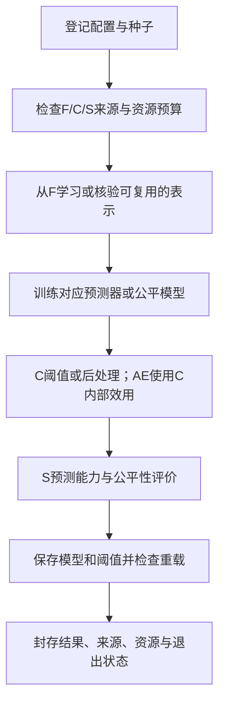

# FairBias 医疗应用研究：任务清单、研究逻辑与组会汇报说明

本文件供研究者理解项目、向导师和师兄汇报使用。它解释已经登记的研究范围，不增加实验、不改变在途任务，也不预设 FairBias 优于其他方法。

**核验快照：2026-09-16 17:26:43（北京时间）。** 当前 Linux 批次登记 1,922 个配置条目，其中 1,918 个可尝试配置、4 个明确不支持的配置条目，展开为 8,054 个种子任务。主 CPU 队列覆盖 6,614 项；FRAPPÉ 480 项和 LFR 960 项尚未启动。15 并发运行；快照共 655 个已封存任务，639 个 VALID、5 个 FAILED、11 个 BUDGET_EXHAUSTED。尚未冻结配置选择，也没有启动本批次的 2024 评价。此处为快照，不是实时监控。

登记文件 SHA-256：`340cd60f6ab0d5919e2ac7bc22b62bdb3cc758faaa986650abdb3978b964732a`。下文任务数由实际登记矩阵计算，不从旧规划估算。模型训练次数、几何拟合次数、数据行数、配置数和种子任务数是不同概念。

## 1. 可以先向导师这样介绍

本项目将 Tang 等人提出的 FairBias 应用于美国 NHIS 健康调查，研究它在识别过去一年因费用延迟就医时，能否兼顾预测能力和不同群体之间的识别差距。我们把 FairBias-BM 作为主方法，匹配相同预测器，比较经典和近期的预处理、训练中约束与后处理公平性方法；同时检验多群体、残疾相关特征、随机种子、调查权重和跨年度变化的影响。研究使用 2022 年开发、2023 年选配置、2024 年冻结后评价，并考虑抽样权重、分层和 PSU。最终成果是有适用边界的应用比较，不把算法公平指标改善等同于实际医疗不平等下降。

目前计算处于开发矩阵阶段；完整性能比较、调查区间及论文结论尚未产生。2024 年曾用于历史实验，所以最终应称回顾性跨年评价，不能称第一次打开的独立盲测。

## 2. 研究对象、四个 arm 与输入数据

### 2.1 到底预测什么

结局为 `MEDDL12M_A`：受访者自报过去 12 个月是否因费用延迟就医。Y=1 表示发生这一障碍。不同年份是重复横断面调查，不是同一批人的随访，因此不能写成“预测同一患者下一年是否延迟就医”。也没有实施分诊、干预或资源分配。

输入包括年龄、教育、地区、家庭人口构成、收入类别、就业、保险、自评健康、部分慢性病、功能限制和通常就医地点。保护属性 A、结局 Y、调查权重、分层、PSU、年份和记录标识分别保存，不作为普通预测特征。缺失结局或当前 A 按固定规则排除；缺失 X 由 F 学习的规则处理，不能因为 X 缺失便任意改变配对人群。

| Arm | 保护属性 | 语义特征数 | 要回答的问题 |
|---|---|---:|---|
| 001 | SEX_A，两组 | 21 | 性别组之间的漏识别、误识别及总体效用有何差异？ |
| 002 | HISPALLP_A，七组 | 21 | 二组方法的结论能否扩展到多群体？少数组是否可估计、是否更不稳定？ |
| 003 | DISAB3_A，两组 | 21 | 保留功能限制构成信息时，残疾公平性和预测信息之间如何权衡？ |
| 004 | DISAB3_A，两组 | 15 | 同人群删除六个功能限制构成变量，会怎样改变预测和公平性？ |

Arm 003 与 004 的人群和分区完全相同。删除的六项为 `visiondf_a`、`hearingdf_a`、`diff_a`、`comdiff_a`、`uppslfcr_a`、`cogmemdff_a`，对应视力、听力、行走/登阶、沟通、自我照料和记忆方面的功能困难。Arm 004 不是“仅分析残疾人”。四臂也不是四次独立外部验证，更不是四种算法。Arm 002/003 等可能因各自 A 缺失而具有不同合格人群，不能直接把跨臂准确率排序当成公平性比较。

### 2.2 四个数据角色

| 分区 | 来源 | 可以做什么 | 产物 |
|---|---|---|---|
| F | 2022 年约 80% PSU | 学习缺失处理、词表/编码/缩放、FairBias 变换、基础预测器、公平训练模型 | 已拟合的预处理、表示和模型 |
| C | 2022 年其余约 20% PSU | 拟合普通概率模型的统一决策阈值、后处理器；AE 内部效用选择 | 阈值、后处理器、AE 开发轨迹 |
| S | 2023 年完整合格样本 | 按冻结规则比较配置与种子，选择每方法的工作点 | 候选表、S 权衡曲线、选择冻结文件 |
| T | 2024 年完整合格样本 | 仅应用已经冻结的模型和规则，计算最终比较与调查推断 | 主表、配对差值、区间和图形 |

F/C 按 `(PSTRAT,PPSU)` 整组分配，并跨臂复用同一主划分。约 80/20 是 PSU 随机分配，不保证记录数恰为 80/20。C 属于开发数据，不能用于宣称独立测试表现。选定后默认不在 F+C+S 上重新拟合。

依据：[主方案的数据与分区](/Users/lkc/Downloads/code_v_0_3/docs/plans/FAIRBIAS_PRIMARY_BENCHMARK_MASTER_PLAN_20260913.md:55)、[特征注册表](/Users/lkc/Downloads/code_v_0_3/configs/nhis/features.json)。

## 3. 先区分预测器、公平性方法、配置与任务

- **预测器**：负责从 X 得到事件分数，例如 LR、GBDT、MLP、TabM。
- **公平性方法**：改变数据、训练目标或决策规则，例如 FairBias、Reweighing、EG、ThresholdOptimizer。
- **配置**：arm、方法、预测器及其参数、公平强度、训练权重制度等共同确定的一种实验设置。
- **种子任务**：某个配置在一个固定随机种子下的完整开发执行。
- **内部拟合**：一个任务中可能多次拟合模型或 MDS；任务数不是内部拟合总数。

例如“Arm003 + FairBias-BM + LR(C=1) + epsilon_ratio=1 + 无调查加权训练 + seed=7”是一个任务。它需要准备 F/C/S、学习或合法复用 F 表示、训练 LR、在 C 定阈值、在 S 评价、保存并检查模型。它不读取 T。

比较 FairBias+LR 与普通 LR，回答变换是否有效；比较 FairBias+LR 与 FairBias+GBDT，回答结论是否依赖预测器；比较 FairBias+GBDT 与 EG+GBDT，才是匹配预测器的公平性方法比较。

## 4. 任务总账：哪些需要训练

| 方法/条件 | 类型 | 配置条目 | 种子任务 | 本批次范围 |
|---|---|---:|---:|---|
| UNMITIGATED | 普通预测器基线 | 88 | 312 | 四臂；匹配各类骨干，含部分训练权重敏感性 |
| FAIRBIAS_BM | 特征变换；本文主方法 | 704 | 3,520 | 四臂；LR、GBDT、MLP、FairGBM 同源骨干、TabM |
| REWEIGHING | 训练前公平重加权 | 32 | 96 | 四臂，LR/GBDT |
| LFR_RECONSTRUCTED | 学习公平表示后接预测器 | 194 | 960 | 三个二组臂；含两个不支持的七组配置条目 |
| EG_DP | 训练中 DP 约束 reduction | 256 | 768 | 四臂，LR/GBDT |
| EG_EO | 训练中 EO 约束 reduction | 256 | 768 | 四臂，LR/GBDT |
| TO_EO | 预测器后的公平阈值优化 | 32 | 96 | 四臂，LR/GBDT |
| OXONFAIR_EO | 近期公平后处理 | 128 | 384 | 四臂，LR/GBDT |
| FAIRRET_EO | 近期可微公平正则 | 16 | 80 | 四臂，匹配 MLP |
| FAIRGBM_EO | 近期带公平约束的提升树 | 96 | 480 | 四臂，FairGBM 同源预测器 |
| FRAPPE_EO | 近期学习式公平后处理 | 98 | 480 | 三个二组臂，LR/GBDT；含两个不支持的七组配置条目 |
| FAIRBIAS_BM_AE | 先 BM 再 AE 的消融 | 8 | 40 | 四臂，LR/GBDT，固定参数 |
| FAIRBIAS_JOINT | BM/AE 交错的消融 | 8 | 40 | 四臂，LR/GBDT，固定参数 |
| 三种 Arm004 几何 | 几何/阈值敏感性 | 6 | 30 | stress-elbow、二维同绝对 epsilon、二维自身 epsilon |
| **总计** | | **1,922** | **8,054** | 4 个不支持条目不生成训练任务 |

当前 6,614 项 CPU 队列包括上表除 LFR、FRAPPÉ 外的任务。某个家族“在队列中”不等于该家族所有配置已经启动或完成。历史 macOS 开发准入不计作当前 Linux 批次完成。

## 5. 每类公平性方法为什么要比较

### 5.1 FairBias-BM：主研究对象

**直观思路**：从保护组之间的特征差异出发，构造特征几何和 d_phi，再尝试数值变换、类别合并等操作，减少几何偏差并检查信息保留条件；之后训练普通预测器。

**研究问题**：不直接以 EO/DP 作为 BM 内部优化目标的几何减偏，在真实医疗调查任务上能否形成有用的预测—公平性权衡？是否需要更强减偏才能改善某些群体？不同预测器是否一致？

**运行内容**：八个 epsilon 比例；五个算法种子；不同骨干；LR/GBDT 另有调查权重训练敏感性。记录实际变换、初始/最终 d_phi、几何与搜索次数、NMI 检查、收敛和失败原因。

主版本叫 `FairBias-BM application-v1`，使用已登记的 stress-elbow、H=1、作者来源的幂序列及多组 `author_max_pair` 等选择。不是宣称逐行复现原论文所有实验。主几何不使用调查权重。d_phi 是内部几何量，不能把它直接叫作 EO、DP 或真实医疗不平等。

### 5.2 Reweighing：简单方法是否已经足够

**类型**：训练前处理。根据 F 中保护组与结局的联合分布改变训练权重，基础预测器结构不变。

**研究问题**：FairBias 相比简单、便宜的重加权是否带来额外收益？如果复杂方法没有胜过这个基线，论文必须如实解释复杂度的代价。

运行四臂、四点 LR/GBDT 参数网格；没有为了凑任务量而人为添加“重加权强度”。公平训练权重不是 NHIS 调查权重。来源：[AIF360 官方 Reweighing 文档](https://aif360.readthedocs.io/en/stable/modules/generated/aif360.sklearn.preprocessing.Reweighing.html)。

### 5.3 LFR：另一种表示学习路线

**类型**：训练前的公平表示学习。当前比较采用官方重构特征接共同 LR/GBDT，保留原始真实 y；不能把重构模块生成的标签用于评价。

**研究问题**：FairBias 的语义特征变换，与经典公平表示重构相比，在相同下游预测器上有什么差异？

原型数 k=5/10，公平损失 Az=0.1/1/10/50，与四点骨干网格、五种子组合。本次官方适配只支持二组，所以七组 Arm002 明确不支持，不改造成白人/非白人。960 项因优化预算准入尚未启动；不能把不能运行或预算不足当作 FairBias 胜出。来源：[LFR，ICML 2013](https://proceedings.mlr.press/v28/zemel13.html)。

### 5.4 EG-DP 与 EG-EO：直接约束决策公平性

**类型**：训练中方法。把公平约束问题转成一系列带代价/权重的分类问题，反复调用基础预测器，再形成混合决策策略。

**研究问题**：直接优化某种决策公平约束的方法，与 FairBias 的几何减偏有什么差异？针对 DP 的约束是否同时有利于 EO，反之如何？

DP 针对群体正决策率差异；EO 同时考虑各组 TPR 和 FPR 差异。每个分支用八个训练约束水平，与 LR/GBDT 网格组合。登记 EG 外循环 max_iter=50；每个任务可能调用基础分类器多次。优化器 eps、训练约束 difference_bound、公共外部 EO 阈值是不同参数。

原生输出为正决策概率 q，不能把它当作“此人发生医疗延迟的事件概率”。来源：[Agarwal 等，ICML 2018](https://proceedings.mlr.press/v80/agarwal18a.html)。

### 5.5 ThresholdOptimizer：只改变决策规则能做到多少

**类型**：后处理。先在 F 训练基础预测器，再在 C 学习与群体有关的阈值/随机化策略。

**研究问题**：如果不重新学习特征表示，仅改变预测器后的决策规则，能否达到类似或更好的效用—公平性权衡？

本次预测时需要 A；底层事件分数 p 与最终策略 q 分开保存。不能把后处理带来的决策公平改善称为底层 AUROC 自动提高。来源：[Hardt 等，2016](https://arxiv.org/abs/1610.02413)。

### 5.6 FairGBM：强提升树内部加入公平约束

**类型**：训练中约束，ICLR 2023。官方实现基于 LightGBM 路线，训练时加入群体 FPR/FNR 约束。本次比较普通同源树、FairBias+同源树、FairGBM，避免把树实现差异混同于公平机制。

**研究问题**：在有竞争力的树模型骨干上，直接加入公平约束与 FairBias 特征变换哪个更有效？

100/200 棵树 ×15/31 叶，六档共同 FPR/FNR slack，四臂、五种子，共 480 项。训练 slack 不等于外部 EO gap 上限。来源：[Feedzai 官方项目](https://github.com/feedzai/fairgbm)。

### 5.7 fairret：神经网络中的公平正则

**类型**：可微训练正则，ICLR 2024。本次在与普通基线匹配的 MLP 损失中加入 TPR/FPR 公平正则。

**研究问题**：在相同神经网络容量下，FairBias 预处理与训练中公平正则有什么差异？

普通 MLP、FairBias+MLP、fairret+MLP 三方匹配；正则系数 0.01/0.1/1/10，100 epochs，四臂、五种子，共 80 个公平模型任务。不能把 fairret 本身当作新的神经网络骨干。来源：[ICLR 2024 论文](https://proceedings.iclr.cc/paper_files/paper/2024/hash/63943ee9fe347f3d95892cf87d9a42e6-Abstract-Conference.html)。

### 5.8 OxonFair：近期灵活的公平后处理

**类型**：后处理工具与方法，NeurIPS 2024。本次在 C 上优化带 EO 约束的决策行为，匹配 LR/GBDT。

**研究问题**：FairBias 与近期后处理方法的权衡是否有竞争力？七组条件是否带来不同的性能和计算代价？

四档 bound，四点骨干网格，二组 grid_width=6、七组=2；后者是已登记的资源适配。本次选定模式需要预测期 A，不能把该部署要求推广为整个工具所有模式的共同限制。其输出按决策 q 处理，不作为校准医疗风险。来源：[NeurIPS 2024 论文](https://proceedings.neurips.cc/paper_files/paper/2024/hash/ab6022d3d669b5baafa24c91d7c407a6-Abstract-Conference.html)。

### 5.9 FRAPPÉ：学习一个公平校正模块

**类型**：学习式后处理，ICML 2024。本次冻结 F 基础模型，在 C 上训练对其输出的校正，使用按 Y 分层的 MinDiff/MMD 目标及保持原分数的正则项。

**研究问题**：在保留基础模型的情况下，学习公平校正与直接修改输入表示相比有什么差异？

三种二组 arm，LR/GBDT 各四点骨干，四档 MinDiff 权重，五种子，共 480 项。使用已登记紧凑隐藏层 16、100 epochs、batch=32；本适配不需要预测时 A，但需要 X 和底层分数。本批次尚待独立 TensorFlow 环境准入。不能把本地旧批次已跑通写成服务器已完成；不能把二组限制扩大为原框架所有实现的理论限制。来源：[ICML 2024 论文](https://proceedings.mlr.press/v235/tifrea24a.html)。

## 6. 为什么还要跑不同预测器

| 预测器 | 本项目中的作用 | 对照设计 |
|---|---|---|
| LR | 主预测器，结构简单，便于解释和稳定比较 | 普通 LR 与所有兼容公平方法+LR |
| sklearn GBDT | 检查非线性/特征交互下的稳健性 | 同树数、深度网格下比较 |
| 普通 MLP | fairret 的容量匹配基线，也检验 FairBias 神经网络适配 | 普通、FairBias、fairret 同结构 |
| FairGBM 同源普通骨干 | 控制提升树实现差异 | 普通、FairBias、FairGBM 同源比较 |
| TabM | 近期表格预测器补充，检验 FairBias 是否与现代骨干兼容 | 普通紧凑 TabM 与 FairBias+相同 TabM |

TabM 是预测模型，不是公平方法，来源为 [ICLR 2025](https://proceedings.iclr.cc/paper_files/paper/2025/hash/c1ba41c694834aeef91ae161711d4939-Abstract-Conference.html)。本次使用 k=4、2 blocks、宽度 64、100 epochs 的紧凑 CPU 配置，不称原论文默认容量的全面复现。普通 TabM 有 20 项，FairBias+TabM 有 160 项，已包含于各方法总账。TabICL、LLM、公平大模型微调不在当前任务范围内。

跨骨干的整体表现可以另作应用比较，但不能仅凭 FairBias+LR 输给某个深模型，就归因于公平机制；同样不能让 FairBias 使用更强骨干后声称公平算法更优。

## 7. FairBias 的 3,520 项怎样展开

| FairBias 条件 | 任务计算 | 任务数 |
|---|---|---:|
| LR，无调查加权训练 | 4臂×4个C×8个epsilon比例×5种子 | 640 |
| GBDT，无调查加权训练 | 4臂×4个树配置×8比例×5种子 | 640 |
| LR，下游调查加权训练 | 同上，仅下游预测器训练权重变化 | 640 |
| GBDT，下游调查加权训练 | 同上，仅下游预测器训练权重变化 | 640 |
| FairGBM 同源普通骨干 | 4臂×4容量×8比例×5种子 | 640 |
| MLP，固定容量 | 4臂×8比例×5种子 | 160 |
| TabM，固定紧凑容量 | 4臂×8比例×5种子 | 160 |
| **合计** | | **3,520** |

epsilon_ratio 为 `[0.25,0.5,0.75,1,1.5,2,4,8]`，乘以该 F、种子与几何定义下的参考量。比例小通常表示更严格的几何容许范围，但不能保证预测 EO 单调下降。算法种子为 `[0,7,19,37,73]`；F/C 分区种子单独固定，五种子不是重新划五次数据。

确定性的普通 LR、RW+LR、EG+LR、TO+LR、OxonFair+LR 只跑 seed 0；FairBias+LR 仍有随机几何，因此保留五种子。相同 F/种子/几何/强度的 BM 表示允许跨下游预测器参数和权重制度复用，所以 3,520 不等于 3,520 次完全独立 BM 学习。

LR 的 C 越小通常意味着更强正则；GBDT 的树数、深度控制模型容量。这些是预测器参数。减偏 epsilon、EG 训练 bound、fairret 系数是公平机制参数。不能把它们的同名数值当作相同公平强度。

## 8. 消融和敏感性：解释为什么有效或失败

| 分析 | 操作 | 解决的问题 | 计数位置 |
|---|---|---|---|
| BM→AE | 先完成 BM，再用 C 效用选择 AE | 能否在严格几何约束下恢复效用？ | 额外40项，已含总账 |
| Joint | 交错执行 BM/AE | 搜索顺序会否改变终点和计算代价？ | 额外40项，已含总账 |
| Arm003 vs 004 | 同人群删去六构成特征 | 代理信息、预测信息与公平性的关系 | 已分布在四臂矩阵，不能再加一次 |
| Arm004 几何 | elbow；二维同绝对epsilon；二维自身参考epsilon | 分开考察几何变化与阈值来源变化 | 额外30项，已含总账 |
| 调查权重训练 | 普通 LR/GBDT、FairBias 下游 LR/GBDT 使用 WTFA | 人口代表性训练是否改变结论？ | 1,376项，已含普通96+FairBias1,280 |
| 算法种子 | 固定配置重复随机几何/训练 | 结论是否依赖偶然初始化？ | 已包含在种子任务数 |
| 0.5阈值敏感性 | 保存概率模型在固定0.5阈值下的指标 | 结论对决策阈值有多敏感？ | 对已有预测计算，不新增训练网格 |
| 三个公共EO工作点 | S选择时使用0.10/0.05/0.20 | 严格和宽松公平预算下的权衡 | 复用候选，不把训练任务数乘3 |
| 无权重评价 | 对同一冻结预测去掉调查权重计算 | 样本结果与人口加权结果是否一致？ | 评价计算，不重新训练 |

AE/Joint 为固定 LR C=1、GBDT100棵/深度2、epsilon_ratio=1 的消融，没有跑全参数 AE 网格。它们不能与充分调参的 BM 直接组成“所有变体均已公平调优”的排名。几何消融比较的也是登记 BM 条件，不足以单独复现并证明旧 Joint 路径的因果机制；解释旧现象还要结合相应轨迹，必要时另立固定条件实验。

当前 AE 的最大几何放宽为0，旧 D8 曾使用0.02；二者科学条件不同。达到预算并不表示优化完成，失败率和未完成状态必须保留。

## 9. 不在 8,054 之内的其他必要任务

### A. 数据与防泄漏验收

校验年度变量编码、原始输入来源、记录键、PSU划分、003/004配对人群、保护组支持、缺失/未知类别策略。检查同一个F学得的映射作用于C/S/T，S/T不能改变词表与填补值。

产物为聚合人群流程表、字段字典、分区来源清单、缺失和组别支持度表。软件契约已建立；最终T的人群描述和适用性仍需评价时生成。它不是再训练几千个模型。

### B. 外部方法数值与运行准入

检查官方来源/实际参数、F/C接口、真实权重路由、保存和重载、不同平台原生库、随机种子以及资源退出。接口跑通只是可执行证据，不能代替公平性实证。

主环境已通过相应准入；FRAPPÉ的Linux环境与LFR的预算仍未闭环。EG_EO一个配置五种子有数值边界失败，另有BM→AE预算退出，保留原记录；不得把这些条目算作对照性能差或FairBias获胜。缺陷修复若影响冻结源码，必须版本化，不能中途覆盖在途批次。

### C. 选配置与模型冻结

核实每个登记种子均有可审计状态。成功配置按各种子S指标均值，在各方法、arm、骨干、权重制度内分别选择。主工作点为EO≤0.10，在可行配置中最大化加权BA；0.05/0.20为敏感性。无可行配置时保留标记清楚的边界结果，不伪造可行赢家。

另保留按S加权AP选定的普通预测参考，不施加公平预算，以避免削弱普通预测基线再宣称FairBias优越。所有选择在T前冻结。S全候选曲线可以展示搜索权衡；T仅展示已冻结点，不能用T重新包络挑最优。

### D. 2024冻结评价

应用冻结预处理、变换、模型、阈值及后处理策略。普通概率方法产生p，按冻结阈值得到0/1决策；EG等保留原生随机决策q。共同计算决策指标；仅合格事件分数用于AP/AUROC/Brier/校准。p被命名为事件分数并不证明已校准。

产物为方法主表、各保护组TPR/FPR/识别比例表、风险预测表、可估性状态、失败及预算说明。这里不再调参或重训。

### E. 复杂调查推断与配对比较

用WTFA_A计算调查加权点估计，保留完整年度PSTRAT/PPSU设计并作域估计。域外贡献为零，不把零贡献PSU删掉。BA及配对差值以Taylor PSU线性化及设计自由度构造区间；EO/DP的极差结构采用同时组率区间投影，PSU bootstrap留作描述性敏感性。

计划2000次共同rescaled-PSU bootstrap是在同一批冻结预测上重算统计量，通常不重训8054个模型。主对比家族是LR、主操作点、Arm001/003上FairBias对五个经典外部对照的BA/EO差值，共20项；家族大小不因某方法失败而缩小。近期方法比较为预声明探索性分析，不能把所有行都写成已通过确认性检验。

固定模型条件下的调查区间不包含完整训练/调参不确定性。五种子变异另报，不能把种子或复制次数当作独立受访者数量。本地已有R survey对照和合成覆盖检查；服务器最终统计环境复核仍需完成。次要风险指标没有设计区间时明确只报点估计和种子变异。

### F. 论文图表与证据整理

把结局、样本流、方法身份、配对差值、组别表现和敏感性联系起来。产物包括主文表图、补充网格/种子/失败矩阵、环境和来源清单，以及逐项结论对照。该阶段要求解释数字，而不是自动把最高分方法写成普遍优越。

## 10. 一项训练任务内部究竟做了什么

BM任务中的表示学习又包含特征组差异、Shapley式上下文距离、MDS选维、候选变换及重新评价。MDS节点是特征和原点，21个特征对应约22×22矩阵，不能说当前耗时来自3万受访者两两形成的巨大MDS矩阵。EG内部会反复调用分类器，AE候选也会多次训练预测器。

已测服务器任务墙时中，普通LR/GBDT常为约5–10秒，EG+GBDT中位约2–3分钟，BM→AE中位约13–21分钟；这些是17:15已结束任务快照，包含启动/保存和部分失败，不是所有未来配置的保证。共享表示后的快速任务不能代表首次学表示的成本。

现有15个单线程worker，单任务4GiB/1800秒、总RSS上限64GiB。租用环境实际16 CPU equivalents、80GiB、4090D 24GB。正式模型实现仍走CPU；GPU只完成一次独立合成可行性测试，没有用于当前正式模型。内存空余不代表应继续增加并发，CPU已接近配额时超额并发可能增加墙时和预算退出。

## 11. 理解这个项目最重要的概念

### 11.1 预测好、公平好、临床有用不是同一个结论

假设1000人中80人有结局，一个永远预测“没有”的分类器准确率为92%，但TPR=0、BA=0.5；各组都预测阴性时DP/EO也可能很小。这个例子不是NHIS实测数据，而是说明为什么不能只看普通accuracy或一个gap。

公平评价中的正决策是“识别存在费用障碍”，不能直接套用信贷拒绝等场景的好坏方向。TPR低意味着更多实际有障碍者没有被识别，FPR高意味着更多没有该自报结局者被识别。临床或政策如何权衡仍需要额外场景论证。

### 11.2 三种阈值不能混淆

| 名称 | 含义 |
|---|---|
| FairBias epsilon | 内部几何偏差容许量 |
| 分类阈值 t | 把事件分数p转换成0/1决策的规则 |
| 公共公平预算 tau | 在S选配置时使用的外部EO gap标准 |

几何可行不保证预测EO可行；S可行不保证T可行。BM内部不以EO优化，但整套应用在S按EO预算选择，不能把端到端研究称为完全与公平指标无关。

### 11.3 三种权重也不同

| 权重 | 用途 |
|---|---|
| WTFA_A | 调查代表性，主要用于人口加权估计及明确登记的训练敏感性 |
| Reweighing公平因子 | 改变F中A与Y联合分布对训练的影响 |
| EG代价权重 | reduction优化过程中构造带代价分类问题 |

方法内部出现sample_weight参数，不等于实现了复杂调查加权公平优化。

### 11.4 更多参数与种子能减少偶然性，也有代价

FairBias有更多设置并不表示比较自动更公正；需要报告各方法的搜索范围、实际拟合调用和资源预算，给对照合理调参。数据S反复用于配置选择仍有选择乐观性，所以必须保留冻结后的T评价，并披露T历史已被观察。8,054项是当前扩展设计的工作量，不是应用论文必须达到的数量门槛。

### 11.5 失败也是结果，但不是性能排名

NOT_SUPPORTED表示选定实现不支持该条件；NOT_ESTIMABLE表示必要组率/分母或设计不可估；BUDGET_EXHAUSTED表示登记预算内未完成；FAILED可能是数值或实现问题；VALID只是通过当前任务契约。所有状态都不能直接推出论文可用或FairBias更好。

### 11.6 Arm004消融不是“删除敏感属性就实现公平”的证明

功能信息既可能携带保护属性信号，也可能携带预测信息。只删六项不能证明所有代理信息已消失，也不能给出残疾对延迟就医的因果效应。我们测量的是固定人群和模型条件下的表现变化。

## 12. 论文证据应怎样组织

| 论文问题 | 对应任务 | 建议产物 |
|---|---|---|
| FairBias是否有竞争力 | 主方法与经典/近期匹配对照 | LR主表、近期方法表、BA/EO配对差图 |
| 是预测改善还是只改变决策 | 普通预测参考、事件分数与策略分离 | AP/AUROC/Brier及校准图、底层风险单列 |
| 哪些群体获益或受损 | 四臂、各组支持度与率 | 群体TPR/FPR/覆盖率图、置信区间 |
| 结论是否依赖预测器 | LR/GBDT/MLP/同源树/TabM | 按骨干分面比较 |
| 代理特征与路径有什么影响 | 003/004、BM→AE、Joint、几何消融 | 配对消融图、轨迹图、预算/失败表 |
| 能否迁移到另一年度 | S冻结后T评价 | 冻结工作点跨年表现和变化 |
| 是否具有调查统计支持 | 加权点估计、完整设计域推断 | 配对差值与设计区间、无权重敏感性 |
| 是否可复查 | 完整配置、种子、来源、模型和退出记录 | 补充材料与可复现实验入口 |

主文讲清研究问题、关键比较、群体影响和适用边界。完整1,922配置明细不全部塞进正文。近期方法和额外骨干主要支持广度；FairBias细致的适配、消融和失败分析支持深度。不能因为主方法不是每项第一，就不停追加方法或改主指标。

建议组会顺序：①医疗问题和结局；②四臂与年份；③公平方法作用位置；④匹配预测器设计；⑤任务总量与计算原因；⑥主方法及消融；⑦调查统计与证据边界；⑧当前进度和未解决事项。汇报时把已实现、已准入、已执行、已冻结评价、可形成结论分别说清。

## 13. 当前范围与后续建议

近期重点是完成已经登记的范围，处理LFR/FRAPPÉ准入及保留的数值/预算问题，核验选择冻结，再评价2024并写论文。不要继续无限扩充模型。

未观察的新年份或独立医疗数据、次结局MEDNG12M_A、交叉群体公平、完整容量TabM/TabICL、额外Joint路径机制实验、正式临床决策效用或成本分析，均可作为未来独立研究建议；当前没有把它们登记为已完成或必须执行的8,054项。没有基于T结果追加这些实验。

## 14. 证据与完整明细

- [完整主方案](/Users/lkc/Downloads/code_v_0_3/docs/plans/FAIRBIAS_PRIMARY_BENCHMARK_MASTER_PLAN_20260913.md)。
- [近期方法、消融和统计规则登记](/Users/lkc/Downloads/code_v_0_3/docs/plans/FAIRBIAS_BENCHMARK_REGISTERED_EXTENSIONS_20260916.md)。
- [算法与统计接手验收](/Users/lkc/Downloads/code_v_0_3/docs/reports/FAIRBIAS_CODEX_INTEGRATION_REVIEW_20260916.md)。其中本地旧批次进度不代表当前服务器批次。
- [服务器启动与尚未准入任务](/Users/lkc/Downloads/code_v_0_3/docs/reports/FAIRBIAS_AUTODL_STARTUP_20260916.md)。其12并发为历史状态，后续已提升为15。
- [15并发交接记录](/Users/lkc/Downloads/code_v_0_3/docs/reports/FAIRBIAS_AUTODL_RESOURCE_INCREASE_20260916.md)。
- [方法能力及适配边界](/Users/lkc/Downloads/code_v_0_3/docs/reports/fairbias_codex_takeover_20260915_154733Z/RECENT_METHOD_CAPABILITY_CARDS.md)。
- 配置展开实现：[核心登记](/Users/lkc/Downloads/code_v_0_3/src/nhis_fairbias/benchmark/experiment_registry.py)、[扩展登记](/Users/lkc/Downloads/code_v_0_3/src/nhis_fairbias/benchmark/experiment_extensions.py)。
- 本次可阅读配置表、完整参数JSON和8,054项任务索引见同目录 `fairbias_task_inventory_20260916/`。这些文件不含受访者记录、模型或行级预测。

本次只增加说明文档及由冻结登记派生的配置明细，没有修改训练源码、调度、参数、数据或进行Git提交。
