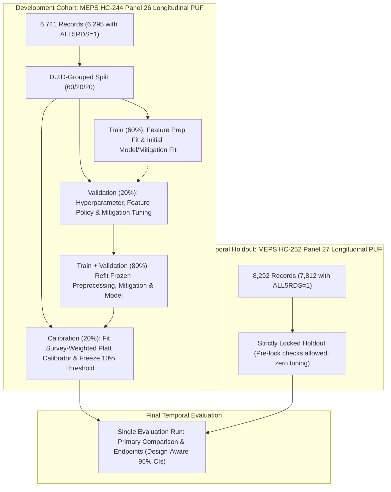

# Research Protocol: Longitudinal Prediction and Fair Allocation of Health Insurance Retention Outreach

**Date**: 2026-08-28  
**Protocol Version**: 1.0.0-pre-data  
**Status**: Frozen (Pending Gate 7 Codebook Verification)

---

## 1. Scientific Question & Research Objective

### 1.1 Core Research Question
Can machine learning models trained on baseline-year demographic, health status, socioeconomic, and healthcare access indicators predict next-year health insurance coverage interruption among continuously insured working-age adults, and how do fair-allocation and bias-mitigation techniques affect predictive accuracy, calibration, and subgroup parity across demographic groups?

### 1.2 Research Context & Significance
Health insurance coverage continuity is a critical policy-relevant dimension of healthcare access in the United States. Public health agencies and outreach organizations have constrained administrative budgets for proactive retention outreach (e.g., personalized renewal assistance, multilingual navigators). Efficient and equitable allocation of these outreach resources motivates investigating risk stratification models that are empirically evaluated for predictive accuracy, calibration, and subgroup performance. Any temporal drift observed across survey panels is measured descriptively without causal attribution to specific policy or macroeconomic mechanisms.

---

## 2. Intended Use and Explicitly Prohibited Uses

### 2.1 Authorized Beneficial Use
This study investigates risk prediction models strictly intended for **beneficial, proactive outreach and supportive retention interventions**:
- Automated renewal reminders and navigation assistance for individuals at elevated risk of administrative coverage disruption.
- Targeted allocation of language-concordant outreach navigators to assist with complex re-enrollment paperwork.
- Descriptive public health research on patterns of coverage instability.

### 2.2 Explicitly Prohibited Uses
The models, methodologies, and findings from this study are **strictly prohibited** from being used for:
- Underwriting or actuarial risk selection.
- Premium pricing or risk-rating.
- Coverage denial, cancellation, or rescission.
- Medicaid/CHIP or commercial eligibility determinations.
- Benefit reduction, tiering, or administrative exclusion.
- Any punitive, disciplinary, or exclusionary decision-making.

> **Disclaimer**: This research represents retrospective public-use survey data analysis for academic and methodological investigation. It does not constitute a deployable clinical decision support tool or commercial insurance product.

---

## 3. Target Population & Estimand

### 3.1 Target Population
The study cohort consists of civilian noninstitutionalized working-age adults in the United States satisfying the following pre-specified criteria:
1. **Age**: 18 to 64 years old at the end of the baseline survey year (Year 1).
2. **Both-Years Eligibility**: Eligible / in scope across both survey years (`YEARIND == 1`).
3. **Longitudinal Participation**: Complete participation across all five survey rounds over two years (`ALL5RDS == 1`).
4. **Longitudinal Representation**: Positive longitudinal analysis weight (`LONGWT > 0`).
5. **Baseline Continuous Coverage**: Continuously insured across all 12 calendar months of the baseline year (Year 1).

### 3.2 Primary Estimand & Survey Representation
The primary estimand is the conditional probability of experiencing at least one month of uninsurance during the subsequent calendar year (Year 2):
$$\Pr(Y = 1 \mid X_{\text{Y1}})$$
where $Y = 1$ indicates $\ge 1$ uninsured month in Year 2, and $X_{\text{Y1}}$ represents the vector of predictors observed exclusively during the baseline year (Year 1).

`LONGWT` supports survey-weighted domain estimates representing the civilian noninstitutionalized population satisfying the frozen eligible cohort criteria, rather than an unrestricted claim about all US adults.

### 3.3 Status of Variable Names
In accordance with Gate 3 protocol, exact monthly insurance coverage variable names and codebook category values are not guessed and remain unresolved until verified against official codebooks in Gate 7.

---

## 4. Two-Panel Temporal Validation Framework

### 4.1 Development Panel: HC-244 Panel 26 Longitudinal Data PUF (2021–2022)
- Used exclusively for cohort construction, feature transformation fitting, model development, hyperparameter selection, fairness mitigation tuning, probability calibration, and decision threshold freezing.
- Partitioned by Dwelling Unit ID (`DUID`) into:
  - **Training Partition (60%)**: Used to fit feature preprocessing pipelines, encoders, and initial model/mitigation arms.
  - **Validation Partition (20%)**: Used solely to select model hyperparameters, feature selection policies, and fairness mitigation trade-off settings.
  - **Refit Step**: Once choices are frozen, the selected preprocessing, mitigation arm, and base model are refit on the combined Train + Validation partition (80%).
  - **Calibration Partition (20%)**: Untouched during model/hyperparameter selection. Used to fit a survey-weighted Platt logistic calibrator and freeze the operational 10% weighted selection probability threshold.

### 4.2 Locked Temporal Holdout: HC-252 Panel 27 Longitudinal Data PUF (2022–2023)
- Maintained under strict holdout lock during pipeline development.
- **Allowed Pre-Lock Checks**: Schema column names and types, documented-code compatibility, file dimensions and record counts, publisher/file hashes, and non-outcome structural integrity checks.
- **Prohibited Pre-Lock Operations**: Inspecting outcome prevalence, protected-group event rates or distributions, feature summaries or marginal distributions, and evaluating or tuning performance metrics.
- Evaluated exactly once at the completion of the study to assess forward temporal transport.

### 4.3 Methodological Claim Boundary
Panel 27 constitutes a **temporal holdout** providing a stronger temporal transport assessment within MEPS than within-panel random cross-validation. It must **not** be characterized as an "independent external validation cohort" or "deployment simulation", because both panels share the MEPS sampling design, institutional framework, and survey instrument.

---

## 5. Scientific Questions, Primary Comparison & Endpoints

### 5.1 Estimable Research Questions
1. **Q1 (Predictive Utility)**: What level of discrimination (weighted AUPRC and AUROC) is achieved on temporal holdout Panel 27 by models trained on baseline sociodemographic, health status, and healthcare access indicators in the eligible working-age cohort?
2. **Q2 (Temporal Transport & Calibration Drift)**: What is the magnitude of discrimination and calibration shift (measured descriptively via survey-weighted calibration intercept, slope, and ECE) when models developed on Panel 26 are evaluated on temporal holdout Panel 27?
3. **Q3 (Fairness Mitigation Trade-offs)**: What is the paired difference in predictive utility (weighted AUPRC) and subgroup error-rate disparity (maximum absolute TPR gap at 10% weighted capacity across primary audit dimensions) between the survey-weighted mitigation extension and unmitigated survey-weighted logistic regression on Panel 27?

### 5.2 Primary Method Comparison & Primary Endpoints
- **Primary Method Comparison**: Survey-weighted mitigation extension versus unmitigated survey-weighted logistic regression, both evaluated using the identical predictor policy and split structure.
- **Primary Utility Endpoint**: Survey-weighted Area Under the Precision-Recall Curve (weighted AUPRC) on Panel 27.
- **Primary Fairness Endpoint**: For each primary audit dimension, compute the maximum absolute pairwise group difference in TPR at 10% weighted capacity; the endpoint is the maximum of those dimension-level gaps on Panel 27. Demographic category mappings remain deferred to Gate 7.
- **Statistical Inference**: Primary comparison estimated via paired differences with design-aware 95% confidence intervals. No single scalar is defined as proof of fairness, and no arbitrary noninferiority margin is invented. All other models, metrics, subgroups, and intersections are designated secondary or exploratory.

---

## 6. Allowed and Prohibited Scientific Claims

### 6.1 Permitted Claims (Subject to Empirical Validation)
- Quantitative discrimination (AUROC, AUPRC), calibration, and error rates of baseline and mitigated models on MEPS public-use data.
- Descriptive characterization of demographic disparities in coverage interruption risk and model error rates under complex survey weighting.
- Comparative evaluation of unmitigated versus mitigated pipelines within the pre-specified experimental protocol.
- Characterization of temporal transport across consecutive MEPS panels without causal claims.

### 6.2 Prohibited Claims
- Claims of operational readiness or real-world effectiveness in deployed clinical or insurance settings.
- Claims of "absolute fairness", "unbiased algorithms", or elimination of systemic disparities.
- Claims that the inherited root script (`code_v_0_3`) was an exact or valid implementation of Tang, Z., Lu, T., & Li, T. (2024).
- Claims of external validation outside the MEPS survey population or simulation of prospective real-world deployment.
- Causal attribution of observed temporal drift to specific macroeconomic, policy, or pandemic-related events.

---

## 7. Official Evidence & Source Citations

1. **Agency for Healthcare Research and Quality (AHRQ)**. *MEPS HC-252 Panel 27 Longitudinal Data Public Use File*. Released September 2025.  
   - File Details: [AHRQ HC-252 Details](https://meps.ahrq.gov/mepsweb/data_stats/download_data_files_detail.jsp?cboPufNumber=HC-252) (Accessed 2026-08-28).  
   - Documentation: [HC-252 Documentation PDF](https://meps.ahrq.gov/data_stats/download_data/pufs/h252/h252doc.pdf) (Accessed 2026-08-28).  
   - Codebook: [HC-252 Codebook PDF](https://meps.ahrq.gov/data_stats/download_data/pufs/h252/h252cb.pdf) (Accessed 2026-08-28).
2. **Agency for Healthcare Research and Quality (AHRQ)**. *MEPS HC-244 Panel 26 Longitudinal Data Public Use File*. Released September 2024.  
   - File Details: [AHRQ HC-244 Details](https://meps.ahrq.gov/mepsweb/data_stats/download_data_files_detail.jsp?cboPufNumber=HC-244) (Accessed 2026-08-28).  
   - Documentation: [HC-244 Documentation PDF](https://meps.ahrq.gov/data_stats/download_data/pufs/h244/h244doc.pdf) (Accessed 2026-08-28).  
   - Codebook: [HC-244 Codebook PDF](https://meps.ahrq.gov/data_stats/download_data/pufs/h244/h244cb.pdf) (Accessed 2026-08-28).
3. **Agency for Healthcare Research and Quality (AHRQ)**. *MEPS Longitudinal Data Files Overview & Guidance*.  
   - Guidance URL: [MEPS Longitudinal Data Files Guidance](https://meps.ahrq.gov/mepsweb/data_stats/more_info_download_data_files.jsp) (Accessed 2026-08-28).
4. **Agency for Healthcare Research and Quality (AHRQ)**. *MEPS Data Use Agreement*.  
   - Agreement URL: [AHRQ Data Use Agreement](https://meps.ahrq.gov/data_stats/data_use.jsp) (Accessed 2026-08-28).  
   - Core Provisions: Statistical reporting and analysis only; absolute prohibition against re-identification; no attempts to link MEPS data with other individually identifiable records; MEPS-NHIS linkage restricted to the AHRQ Data Center, NCHS Research Data Center, or U.S. Census Research Data Center network; formal citation required.
5. **Tang, Z., Lu, T., & Li, T.** (2024). *Metric-Independent Mitigation of Unpredefined Bias in Machine Classification*. Intelligent Computing, 3, Article 0083. DOI: [10.34133/icomputing.0083](https://doi.org/10.34133/icomputing.0083).  
   - *Erratum*: Intelligent Computing, Article 0125. DOI: [10.34133/icomputing.0125](https://doi.org/10.34133/icomputing.0125) (Addresses omitted funding acknowledgment; does not invalidate methodology).
