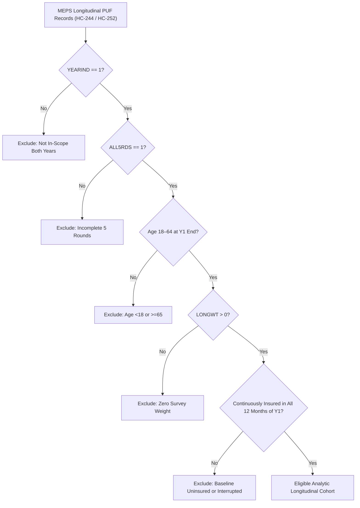

# Statistical Analysis Plan (SAP)

**Study Title**: Longitudinal Prediction and Fair Allocation of Health Insurance Retention Outreach in MEPS  
**Date**: 2026-08-28  
**SAP Version**: 1.0.0-pre-data  
**Status**: Frozen (Pending Gate 7 Codebook Verification)

---

## 1. Study Design & Cohort Flow

### 1.1 Source Datasets
The study employs two consecutive longitudinal panels from the Medical Expenditure Panel Survey (MEPS):
- **Development Panel**: MEPS HC-244 Panel 26 Longitudinal Data Public Use File (covering 2021 [Year 1] to 2022 [Year 2]; released September 2024; 6,741 total person records; 6,295 with `ALL5RDS = 1`).
- **Temporal Holdout Panel**: MEPS HC-252 Panel 27 Longitudinal Data Public Use File (covering 2022 [Year 1] to 2023 [Year 2]; released September 2025; 8,292 total person records; 7,812 with `ALL5RDS = 1`).

### 1.2 Inclusion and Exclusion Criteria

1. **Both-Years Eligibility**: Must be eligible / in scope across both survey years (`YEARIND == 1`).
2. **Complete Survey Rounds**: Must have completed all five survey rounds over the two-year panel (`ALL5RDS == 1`).
3. **Target Age Range**: Must be aged 18 to 64 inclusive at the end of baseline Year 1 (Y1 age variable).
4. **Positive Longitudinal Weight**: Must have a positive longitudinal analysis weight (`LONGWT > 0`).
5. **Continuous Baseline Insurance**: Must have active health insurance coverage in all 12 calendar months of baseline Year 1. Individuals with any uninsurance month in Year 1 are excluded to isolate the transition from continuous coverage to coverage disruption.
6. **Exact Variable Mapping Status**: Exact monthly coverage variable names, age variable names, and codebook values remain unresolved pending Gate 7 codebook verification. No variable names are guessed in this plan.

---

## 2. Dataset Partitioning, Development Flow & Test Isolation Policy

### 2.1 Development Cohort Partitioning & Refit Flow (HC-244 Panel 26)
To prevent intra-household information leakage while preserving population balance, partitioning is performed strictly at the household/dwelling unit level:
- **Unit of Grouping**: Dwelling Unit ID (`DUID`). All individuals sharing a `DUID` are assigned to the same partition. Never split by row.
- **Initial Partition Ratios**:
  - **Training Set (60%)**: Used for feature transformation fitting, imputer fitting, predictive model training, and fairness mitigation parameter exploration.
  - **Validation Set (20%)**: Used solely to select model hyperparameters, feature selection policies, and fairness mitigation trade-off settings.
  - **Calibration Set (20%)**: Untouched during feature and model selection.
- **Refit Protocol**:
  - Once model hyperparameters, feature selection policies, and mitigation settings are frozen, the selected preprocessing pipeline, mitigation arm, and base model are **refit on the combined Train + Validation partition (80%)**.
- **Probability Calibration**:
  - A survey-weighted Platt logistic calibrator is fit on the untouched Calibration Set (20%). Platt scaling is prespecified as the primary calibration method (not left data-dependent).
- **Threshold Freezing**:
  - One conventional probability threshold is frozen from the calibrated Panel 26 calibration set at 10% weighted population selection. This numeric threshold is applied unchanged to Panel 27, distinguishing fixed-threshold evaluation from rank-based top-K capacity evaluation within each panel.
- **Grouping Algorithm**: Grouped stratified split approximately balancing the target prevalence and survey weight deciles across folds. The grouping seed and assignment hashes are permanently recorded in the run manifest.

### 2.2 Locked Temporal Holdout Policy (HC-252 Panel 27)
- **Strict Isolation**: HC-252 Panel 27 is fully locked during pipeline development. No outcome prevalences, protected-group event rates, feature summaries/distributions, or evaluation metrics may be viewed or utilized to adjust any pipeline parameter.
- **Allowed Pre-Lock Checks**: Checking schema column names and types, documented-code compatibility, file dimensions and record counts, publisher/file hashes, and non-outcome structural integrity checks (e.g., verifying presence of `ALL5RDS`, `YEARIND`, `DUID`, `LONGWT`, `VARSTR`, `VARPSU`).
- **Prohibited Pre-Lock Checks**: Inspecting outcome prevalence, protected-group rates or distributions, predictor feature distributions, and calculating or tuning performance metrics.
- **Single Evaluation Run**: Formal evaluation on Panel 27 occurs exactly once after all models, transformers, hyperparameters, calibration maps, and decision thresholds are frozen.
- **Rerun Policy**: Re-evaluation is permitted only in the event of a documented, fatal code error, accompanied by an explicit incident report.
- **Claim Limitation**: Panel 27 represents a temporal holdout providing stronger temporal transport assessment within MEPS, **not** an independent external validation dataset or deployment simulation.

---

## 3. Predictor Timing & Missing Value Strategy

### 3.1 Strict Predictor Temporal Cutoff
- Predictor features must reflect information available on or before the conclusion of baseline Year 1 (Round 3 / end of Year 1).
- **Prohibited Predictors**:
  - Any Year 2 (Y2) variables (e.g., Y2 coverage, Y2 health status, Y2 healthcare utilization, Y2 employment transitions).
  - Post-baseline events or future-derived variables.
  - Record and person identifiers (`DUPERSID`, `DUID`, `PID`, `PANEL`, family IDs), which serve exclusively for grouping, survey design, and provenance.

### 3.2 Missing Value Handling
- **No Global Rules**: Global negative-value imputation (e.g., treating all negative numbers as -1 or NaN) is strictly prohibited.
- **Codebook-Specific Decoding**: Missing values must be decoded variable by variable from the official codebooks, distinguishing structural/inapplicable states from nonresponse or cannot-compute states only when the documented value labels support that distinction. No numeric missing-code list is assumed globally.
- **Imputation & Encoding Protocol**:
  - All categorical encoders, numerical scalers, missing-indicator flags, and imputation models must be fit strictly on authorized training data (Training partition during development; Train+Validation during refit) and applied out-of-sample to Validation, Calibration, and Temporal Holdout sets.

---

## 4. Model Architectures & Mitigation Arms

### 4.1 Predictive Model Arms
1. **Primary Predictive Baseline**: Survey-weighted Logistic Regression with elastic-net regularization.
2. **Secondary Machine Learning Models**:
   - Random Forest Classifier (with sample weights).
   - Histogram Gradient Boosting Classifier (with sample weights).
   - *Constraint*: Secondary models will only be executed if installed library versions natively support survey sample weights and deterministic reproducibility; unsupported features will not be promised.

### 4.2 Fairness Mitigation Arms
Three comparative arms are evaluated:
1. **Unmitigated Baseline**: Standard models trained on survey-weighted baseline features without fairness constraints.
2. **Paper-Informed Reconstruction**: A leakage-free reconstruction of the metric-independent bias mitigation methodology from Tang, Z., Lu, T., & Li, T. (2024). Candidate settings are learned on Training and selected on Validation; after freezing, the selected reconstruction is refit on Train + Validation under the development flow in Section 2.1.
   - *Provenance Note*: This is a clean, paper-informed re-implementation and is never characterized as an exact reproduction of the flawed legacy `code_v_0_3` root scripts.
3. **Survey-Weighted Mitigation Extension**: An extension of the paper-informed reconstruction incorporating survey analysis weights (`LONGWT`) into the mitigation objective and feature transformation.

---

## 5. Primary Comparison, Endpoints & Capacity-Aware Metrics

### 5.1 Primary Method Comparison & Primary Endpoints
- **Primary Comparison**: Survey-weighted mitigation extension versus unmitigated survey-weighted logistic regression, both evaluated using the identical predictor policy and split structure.
- **Primary Utility Endpoint**: Survey-weighted Area Under the Precision-Recall Curve (weighted AUPRC) on Panel 27.
- **Primary Fairness Endpoint**: Within each primary audit dimension, take the maximum absolute pairwise group difference in TPR at 10% weighted capacity; then take the maximum across primary dimensions on Panel 27. Demographic category mappings remain deferred to Gate 7.
- **Primary Inference Standard**: Paired difference estimation with design-aware 95% confidence intervals. No single scalar will be defined as proof of fairness, and no arbitrary noninferiority margin will be invented. All other models, metrics, groups, and intersections are designated secondary or exploratory.

### 5.2 Discrimination & Probabilistic Accuracy Metrics
- **Weighted AUROC**: Area under the survey-weighted Receiver Operating Characteristic curve.
- **Weighted AUPRC**: Area under the survey-weighted Precision-Recall curve (primary utility endpoint).
- **Weighted Brier Score**: Mean squared error of predicted probabilities:
  $$\text{Brier} = \frac{\sum_{i} w_i (\hat{p}_i - y_i)^2}{\sum_{i} w_i}$$

### 5.3 Calibration Metrics
- **Calibration Intercept & Slope**: From survey-weighted logistic calibration regression: $\text{logit}(y) = a + b \cdot \text{logit}(\hat{p})$.
- **Expected Calibration Error (ECE)**: Weighted average difference between predicted risk and empirical event rate across risk deciles.

### 5.4 Capacity-Aware Operational Metrics
Reflecting practical resource constraints in public health retention outreach:
- **Prespecified Capacities**: Fixed capacity fractions at 5%, 10%, and 20%.
- **Capacity Definition**: Primary capacity is defined as the top $K\%$ of the represented population ranked by predicted risk and accumulated by longitudinal weight `LONGWT`. Unweighted top $K\%$ of sample is computed as secondary sensitivity only.
- **Recall at Capacity (5%, 10%, 20%)**: Proportion of all coverage-interrupted individuals captured within the top $K\%$ weighted population.
- **Precision (PPV) at Capacity (5%, 10%, 20%)**: Proportion of individuals in the top $K\%$ weighted population who actually experience coverage interruption.

### 5.5 Fixed-Threshold Metrics
- Conventional binary classification metrics (Sensitivity, Specificity, PPV, NPV, F1) evaluated at the single probability threshold frozen from the calibrated Panel 26 calibration set at 10% weighted selection and applied unchanged to Panel 27.

---

## 6. Fairness Reporting & Subgroup Suppression Policy

### 6.1 Protected Demographic Dimensions
- **Primary Audit Dimensions**:
  - Race / Ethnicity
  - Sex
- **Secondary Audit Dimensions**:
  - Baseline Family Poverty Category
  - Baseline Age Band
  - Baseline Disability / Functional Limitation Status
- **Category Mapping Status**: All category mappings, coding definitions, and group boundaries are strictly deferred to Gate 7 codebook verification. No category labels are pre-enumerated before Gate 7.
- **Role**: Protected attributes serve exclusively as audit and evaluation variables; they are not primary predictors.

### 6.2 Primary Fairness Metrics
- **Weighted Subgroup Calibration & Brier Score**: Evaluated independently within each demographic subgroup.
- **Subgroup Error-Rate Gaps**:
  - True Positive Rate (TPR) Gap / Equal Opportunity Disparity (primary fairness endpoint at 10% weighted capacity).
  - False Positive Rate (FPR) Gap / Predictive Equality Disparity.
  - Positive Predictive Value (PPV) Gap / Predictive Parity Disparity.
  - Selection Rate Gap / Demographic Parity Disparity.
- **Bias Concentration Quantity**: Paper-informed metric quantifying the concentration of predictive bias across feature sub-spaces.
- **Reporting Standard**: Disaggregate group-specific values and inter-group gaps with design-aware 95% confidence intervals. No single fairness scalar will be used to assert that a model is "fair."

### 6.3 Subgroup Suppression & Sample Size Rules
To prevent unreliable statistical estimation and disclosure risks in small subgroups:
- An audit subgroup or intersectional cell is **suppressed** from reporting if:
  1. Unweighted sample size $n < 100$, OR
  2. Total positive outcomes (coverage interruptions) $< 20$, OR
  3. Total negative outcomes (retained coverage) $< 20$, OR
  4. Kish effective sample size $n_{\text{eff}} = \frac{(\sum w_i)^2}{\sum w_i^2} < 50$.
- **Suppression Protocol**: Suppressed cells are explicitly labeled `"Suppressed (Insufficient Sample/Power)"`. Under no circumstances will groups be merged *ad hoc* after viewing empirical results.

---

## 7. Complex Survey Weighting & Statistical Uncertainty

### 7.1 Analysis Weights & Domain Representation
- **Analysis Weight**: `LONGWT` is applied to all primary point estimates to produce survey-weighted domain estimates representing the civilian noninstitutionalized US population satisfying the frozen eligible cohort criteria, not an unrestricted claim about all US adults.
- **Design Variables**: `VARSTR` (strata) and `VARPSU` (primary sampling unit) represent the complex sampling structure. They are design variables and **must never be used as predictive features**.

### 7.2 Variance Estimation & Confidence Intervals
- **Primary Methodology**: 95% confidence intervals and paired difference tests are computed using design-aware stratified PSU bootstrap/resampling using `VARSTR` and `VARPSU`, subject to implementation validation.
- **Strict Substitution Policy**: BRR and generic menus of alternative variance estimators are removed. If the survey design or data structure cannot support the validated stratified PSU resampling method, execution must stop for escalation rather than silently substituting an unvalidated method.
- **Multiplicity Control**: One primary model comparison (survey-weighted mitigation extension vs. unmitigated survey-weighted logistic regression on primary endpoints) is pre-specified. Subgroup and intersectional comparisons are treated as secondary/exploratory, reported with 95% confidence intervals and effect sizes.

---

## 8. Sensitivity Analyses

1. **Outcome Definition Sensitivity**:
   - *Sensitivity Outcome 1*: Prolonged uninsurance ($\ge 3$ uninsured months in Year 2).
   - *Sensitivity Outcome 2*: End-of-year uninsurance (uninsured in December / Month 12 of Year 2).
   - *Requirement*: Evaluated only if official codebooks unambiguously support construction.
2. **Survey Weighting Sensitivity**:
   - Unweighted model training and evaluation versus survey-weighted estimation.
3. **Capacity Basis Sensitivity**:
   - Unweighted top $K\%$ sample capacity versus primary survey-weighted population capacity.

---

## 9. Seeds, Resource Limits & Execution Guardrails

### 9.1 Frozen Random Seeds
To guarantee exact reproducibility across all stochastic operations (splitting, initialization, bootstrap resampling), five fixed seeds are frozen:
- Seeds: `20260828`, `20260829`, `20260830`, `20260831`, `20260832`.

### 9.2 Computational Scaling Guardrails
- **Prohibited Operations**: Full sample-by-sample pairwise distance or difference matrices of $O(N^2)$ complexity (e.g., legacy `eval.py` `num-c` / `num-d` operations) are strictly prohibited on full MEPS cohorts.
- **Local Target Hardware**: Apple Silicon Mac (24 GB unified memory).
  - Peak RSS memory limit: $< 16\text{ GB}$.
  - Smoke test execution time: $< 30\text{ minutes}$.
- **Server Escalation**: If computational demands exceed local thresholds, execution may be escalated to a compute server as a resource management decision without altering the research estimand.

---

## 10. Study Stop & Escalation Conditions

Execution must immediately pause and escalate to the supervisor under any of the following conditions:
1. **Target Variable Harmonization Failure**: Monthly insurance status variables cannot be consistently harmonized between HC-244 and HC-252.
2. **Design Structure Invalidation**: Survey design variables (`LONGWT`, `VARSTR`, `VARPSU`) fail structural validity checks (e.g., negative weights, unlinked PSUs).
3. **Statistical Underpowering**: Fewer than 200 eligible positive outcome cases ($Y=1$) in either HC-244 or HC-252 analytic cohorts. The study must be marked underpowered before considering any estimand change.
4. **Data Leakage Failure**: Any automated leakage test fails. Note: Nonzero mutual information between legitimate baseline predictors and the Year 2 outcome is expected predictive signal and is not leakage. Leakage failures include:
   - Inclusion of Year 2 or post-baseline columns in predictor feature sets.
   - Person-level or household (`DUID`) overlap across train/validation/calibration partitions.
   - Preprocessing transformers (scalers, encoders, imputers) fitted beyond authorized training partitions.
   - Use of Panel 27 outcomes, subgroup distributions, or performance metrics for pipeline tuning or selection.
5. **Variance Estimation Failure**: If stratified PSU bootstrap resampling cannot be validated or supported on the design structure.
6. **Manifest Irreproducibility**: A completed pipeline run cannot be reproduced identically from its execution manifest and random seed.

---

## 11. Decisions Frozen Now vs. Deferred to Gate 7

| Analysis Decision | Gate 3 Status | Gate 7 Action |
|---|---|---|
| Primary Estimand & Target Population Definition | **FROZEN** | Confirmed against decoded codebook |
| Both-Years Eligibility Rule (`YEARIND == 1`) | **FROZEN** | Verified in data extraction filter |
| Two-Panel Design (HC-244 Dev / HC-252 Holdout) | **FROZEN** | Implemented in data loader |
| DUID-Grouped Partitioning (60/20/20) & Refit Flow | **FROZEN** | Split assigned and hashed |
| Survey-Weighted Platt Calibration on Calibration Set | **FROZEN** | Implemented in calibrator module |
| Fixed 10% Weighted Calibration Threshold Policy | **FROZEN** | Frozen and transferred to holdout |
| Primary Method Comparison & Primary Endpoints | **FROZEN** | Implemented in evaluation module |
| Subgroup Suppression Rules ($n<100$, pos/neg $<20$, $n_{\text{eff}}<50$) | **FROZEN** | Implemented in reporting tables |
| Reproducibility Seeds (`20260828`–`20260832`) | **FROZEN** | Bound in configuration files |
| Exact Monthly Insurance Variable Names & Codes | *DEFERRED* | Verified against official PDF codebooks |
| Exact Sociodemographic Predictor Variable List | *DEFERRED* | Harmonized and mapped across panels |
| Protected Dimension Category Mappings & Codes | *DEFERRED* | Verified against official PDF codebooks |
| Baseline Year-End Age Variable Name | *DEFERRED* | Verified against official PDF codebooks |
